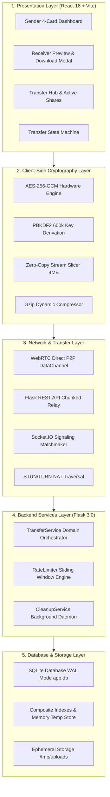
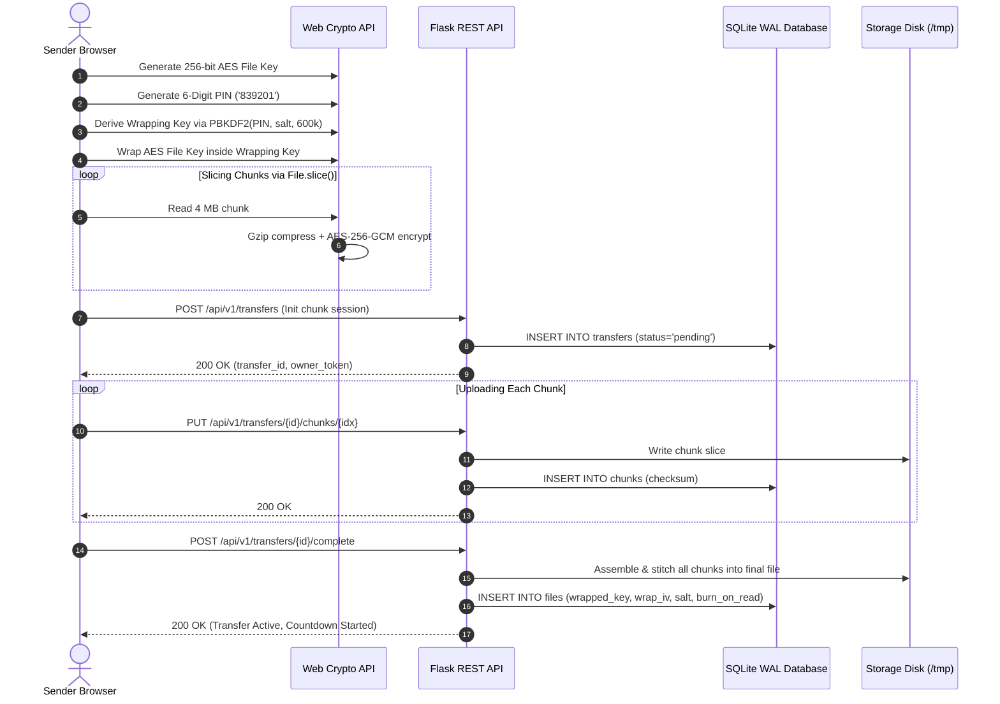
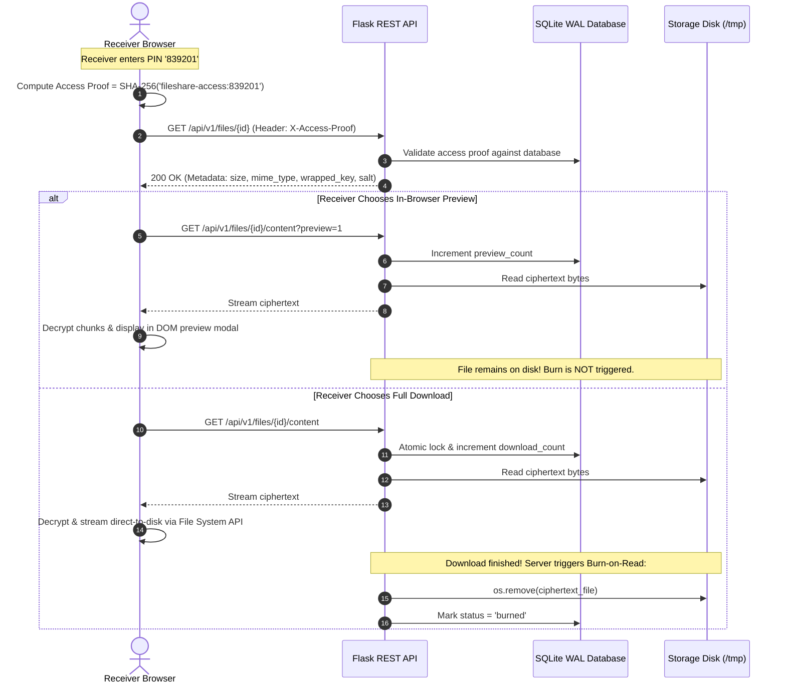
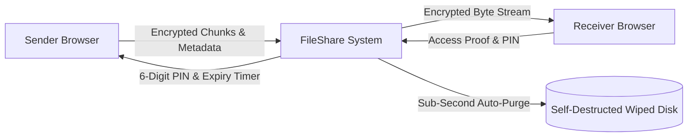

# FileShare — Complete Architecture, Design & Engineering Guide
## High-Level Design (HLD) & Low-Level Design (LLD) Blueprint
### Written in Clear, Simple English Points with Real-World Analogies & Diagrams

> **System Summary**: FileShare is a high-performance, zero-knowledge encrypted file transfer platform. It enables direct browser-to-browser peer data transfers (WebRTC) and serverless encrypted cloud relay. It transfers up to 20 files per bundle (up to 1 GB total) while keeping device memory flat at **~4 MB** using stream processing, sub-second countdown auto-purging (15s–180s), and strict Burn-After-Read self-destruction.

> [!TIP]
> - **[README.md](README.md)**: Main project overview, quick start guide, and live demo.
> - **[TECHNICAL_EXPLANATION.md](TECHNICAL_EXPLANATION.md)**: 75-question comprehensive viva and presentation cheat sheet.

---

## 📑 Table of Contents
1. [Requirements Engineering (FR & NFR)](#1-requirements-engineering-fr--nfr)
2. [Noun-Verb Analysis & Object Identification](#2-noun-verb-analysis--object-identification)
3. [Object-Oriented Design (OOD) & The 4 OOP Pillars](#3-object-oriented-design-ood--the-4-oop-pillars)
4. [SOLID Principles (Explained in Simple Points with Code)](#4-solid-principles-explained-in-simple-points-with-code)
5. [Design Patterns Catalog (10 GoF Patterns in FileShare)](#5-design-patterns-catalog-10-gof-patterns-in-fileshare)
6. [Complete UML & Architectural Diagrams](#6-complete-uml--architectural-diagrams)
7. [Database Scalability & Relational Modeling](#7-database-scalability--relational-modeling)
8. [Security Architecture & Zero-Knowledge Cryptography](#8-security-architecture--zero-knowledge-cryptography)
9. [Networking, Protocols & WebRTC Architecture](#9-networking-protocols--webrtc-architecture)
10. [File Transfer Pipeline & Performance Scalability](#10-file-transfer-pipeline--performance-scalability)
11. [Enterprise Scalability & PostgreSQL Migration Roadmap](#11-enterprise-scalability--postgresql-migration-roadmap)
12. [Testing & Quality Assurance Matrix (178 Tests)](#12-testing--quality-assurance-matrix-178-tests)

---

## 1. Requirements Engineering (FR & NFR)

### 1.1 Functional Requirements (FR) — What the System Does
- **FR-1: File Selection & Multi-File Bundling**:
  - Users can select 1 to 20 files at once (up to 1 GB total aggregate size).
  - Multiple files are packed on the client into a single virtual container (`FSBUNDLE1`).
- **FR-2: Zero-Knowledge Client-Side Encryption**:
  - Every file is encrypted inside the browser using **AES-256-GCM** before touching the network.
  - Encryption keys are never sent to the server. The server stores only scrambled binary code.
- **FR-3: Dual Transfer Modes (Hybrid Architecture)**:
  - *Direct P2P*: WebRTC DataChannels stream data directly between browsers when both users are online.
  - *Cloud Relay*: Automatic fallback to the Flask REST API if firewalls block P2P.
- **FR-4: 13-Tier Smart Transfer Optimization**:
  - Automatically selects chunk sizes (from direct single-pass up to 3.25 MB) and buffer strategies based on file size.
- **FR-5: 6-Digit OTP Transfer Codes & Dynamic QR Codes**:
  - Every transfer is assigned an easy 6-digit numeric PIN (`839201`) and a dynamic QR code for quick sharing.
- **FR-6: In-Browser File Preview**:
  - Receivers can safely inspect photos, videos, audio, PDF documents, and text files directly in a browser modal before saving to disk.
  - Previews **do not** burn or delete the file.
- **FR-7: Direct-to-Disk Streaming**:
  - Modern browsers use the **File System Access API** (`showSaveFilePicker`) to stream decrypted bytes directly into the computer's hard drive without filling RAM.
- **FR-8: Ephemeral Countdown Expiry**:
  - Senders set auto-wipe countdown timers: **15s, 30s, 45s, 60s (1 min), 120s (2 min), or 180s (3 min)**.
- **FR-9: Burn-After-Read Self-Destruction**:
  - Immediately upon download completion, the server physically deletes the file from disk and database.
- **FR-10: Sender Management & Instant Revocation**:
  - Senders can track active transfers and cancel/delete files instantly using their secret `owner_token`.
- **FR-11: Personal Storage Quotas**:
  - Enforces a 1 GB active storage cap per anonymous client ID to prevent abuse.
- **FR-12: Steganography Image Vault**:
  - Senders can hide encrypted files (<10 MB) inside the pixels of a PNG image.

### 1.2 Non-Functional Requirements (NFR) — How Well the System Performs
- **NFR-1: Security & Confidentiality**:
  - AES-256-GCM authenticated encryption with 128-bit authentication tags.
  - PBKDF2 key derivation with 600,000 iterations (OWASP 2023 recommendation).
- **NFR-2: Memory Efficiency**:
  - Browser RAM consumption remains flat at **~4 MB** regardless of whether the file is 5 MB or 1 GB.
- **NFR-3: High Responsiveness & Low Latency**:
  - API endpoints respond in <50 milliseconds.
  - Frontend yields to the event loop during crypto operations to keep UI animations at a smooth 60fps.
- **NFR-4: Scalability & Concurrency**:
  - SQLite runs in **WAL (Write-Ahead Logging)** mode with composite indexes and in-memory caches.
  - Prepared statements and parameterized queries prevent SQL injection.
- **NFR-5: Reliability & Fault Tolerance**:
  - Single-chunk retransmission allows recovering from dropped connections without re-uploading the whole file.
- **NFR-6: Privacy by Design**:
  - Zero user accounts, zero passwords, zero tracking cookies, and zero persistent IP logs.

---

## 2. Noun-Verb Analysis & Object Identification

### 2.1 Extracting Objects from Requirements

| System Requirement Statement | Nouns (Identified Objects & Entities) | Verbs (Identified Methods & Operations) |
| :--- | :--- | :--- |
| "Sender selects files, bundles them, and encrypts with AES-256-GCM." | `Sender`, `File`, `BundleArchive`, `CryptoEngine` | `selectFiles()`, `createBundle()`, `encryptPayload()` |
| "System creates 6-digit OTP code and derives wrapping key via PBKDF2." | `TransferCode`, `WrappingKey`, `PBKDF2Deriver`, `Salt` | `generateCode()`, `deriveKey()`, `wrapKey()` |
| "TransferService writes metadata to DatabaseManager and chunks to StorageManager." | `TransferService`, `DatabaseManager`, `StorageManager`, `Chunk` | `saveMetadata()`, `writeChunk()`, `commitTransaction()` |
| "WebRTCManager negotiates SDP offer and streams binary data over DataChannel." | `WebRTCManager`, `PeerConnection`, `SignalingServer`, `DataChannel` | `createOffer()`, `exchangeCandidate()`, `sendBinaryChunk()` |
| "Receiver verifies access proof, downloads stream, and saves to disk." | `Receiver`, `AccessProof`, `DownloadStream`, `FileSystemAdapter` | `verifyProof()`, `streamDownload()`, `saveToDisk()` |
| "CleanupService checks expiry timestamps and deletes expired files." | `CleanupService`, `Timer`, `ExpiryRecord` | `checkExpiry()`, `unlinkFile()`, `purgeExpiredRows()` |

### 2.2 Class-Responsibility-Collaborator (CRC) Cards

#### CRC Card 1: `TransferService`
- **Class**: `TransferService` (Backend Business Logic Layer)
- **Responsibilities**:
  - Validates upload payloads and size limits.
  - Coordinates chunk assembly and file stitching.
  - Manages atomic download locks and Burn-After-Read self-destruction.
  - Checks personal user storage quotas.
- **Collaborators**: `DatabaseManager`, `StorageManager`, `RateLimiter`.

#### CRC Card 2: `DatabaseManager`
- **Class**: `DatabaseManager` (Data Access Layer)
- **Responsibilities**:
  - Manages SQLite connection lifecycle.
  - Sets WAL mode, composite indexes, and memory PRAGMAs.
  - Provides atomic transaction management (`with db.transaction():`).
  - Collects database performance metrics.
- **Collaborators**: `sqlite3.Connection`, `sqlite3.Row`.

#### CRC Card 3: `CryptoFacade`
- **Class**: `CryptoFacade` (`crypto.js` in Frontend Client)
- **Responsibilities**:
  - Generates random 256-bit AES file encryption keys.
  - Derives Wrapping Keys using PBKDF2-SHA-256 (600,000 rounds).
  - Slices files and encrypts chunks with unique per-chunk IVs.
  - Validates GCM authentication tags upon decryption.
- **Collaborators**: `SubtleCrypto`, `CompressionStream`, `DataView`.

#### CRC Card 4: `ChunkManager`
- **Class**: `ChunkManager` (`chunkManager.js` in Frontend Client)
- **Responsibilities**:
  - Implements the 13-tier smart optimization table.
  - Slices raw files into array buffers using `File.slice()`.
  - Packages multi-file bundles into `FSBUNDLE1`.
  - Monitors network backpressure to prevent buffer overflows.
- **Collaborators**: `File`, `Blob`, `RTCDataChannel`, `XMLHttpRequest`.

---

## 3. Object-Oriented Design (OOD) & The 4 OOP Pillars

### 3.1 Encapsulation (Data Hiding)
- **What it means**: Keeping internal state private and exposing only safe, public methods.
- **How FileShare uses it**:
  - `DatabaseManager` keeps raw SQLite connection handles private. Callers use public methods like `db.get_db_metrics()` or the context manager `with db.transaction():`.
  - `crypto.js` wraps private cryptographic keys inside browser Web Crypto `CryptoKey` handles marked as `extractable: false`. JavaScript code cannot inspect or leak the raw key bytes!

### 3.2 Abstraction (Hiding Complexity)
- **What it means**: Giving users a simple interface while hiding complicated underlying mechanics.
- **How FileShare uses it**:
  - `StorageManager` exposes simple methods: `save_chunk()`, `delete_file()`, `file_exists()`.
  - `TransferService` doesn't know or care whether files are saved on local hard disk, a serverless `/tmp` folder, or an AWS S3 bucket. The storage complexity is completely abstracted away.

### 3.3 Inheritance (Reusability & Hierarchy)
- **What it means**: Child classes inherit properties and methods from a common parent class.
- **How FileShare uses it**:
  - Centralized error hierarchy in `api/errors.py`:
    ```
    ApiError (Base Exception)
      ├── NotFoundError (404)
      ├── GoneError (410 - Burned/Expired)
      ├── ForbiddenError (403 - Invalid Token)
      ├── ConflictError (409)
      ├── ValidationError (400)
      └── PayloadTooLargeError (413)
    ```
  - Any endpoint can raise these exceptions, and the Flask global error handler catches and formats them into clean JSON responses automatically.

### 3.4 Polymorphism (Many Forms, One Interface)
- **What it means**: Different classes can implement the same interface and be used interchangeably.
- **How FileShare uses it**:
  - The client transfer strategy supports three interchangeable modes:
    1. `WebRTCDirectStrategy`: Streams over browser data channels.
    2. `CloudRelayStrategy`: Streams over HTTP multipart requests to the server.
    3. `SteganographyVaultStrategy`: Injects bytes into PNG image pixels.
  - The UI invokes `transferStrategy.send(file)` without needing to know which mode is active under the hood!

---

## 4. SOLID Principles (Explained in Simple Points with Code)

### 4.1 S — Single Responsibility Principle (SRP)
- **Rule**: A class should have one, and only one, reason to change.
- **FileShare Implementation**:
  - `StorageManager` only touches physical files on disk.
  - `DatabaseManager` only runs SQL queries and manages transactions.
  - `RateLimiter` only tracks request timestamps and prevents spam.
  - *Benefit*: Modifying database indexes never breaks file upload logic.

### 4.2 O — Open/Closed Principle (OCP)
- **Rule**: Software entities should be open for extension, but closed for modification.
- **FileShare Implementation**:
  - The `previewManager.js` module uses a pluggable registry of file renderers (Images, Video, Audio, PDF, Code).
  - To add support for 3D files (`.obj`), developers simply register a new 3D preview component without editing or risking any existing video or PDF preview code.

### 4.3 L — Liskov Substitution Principle (LSP)
- **Rule**: Subclasses must be substitutable for their base class without breaking the application.
- **FileShare Implementation**:
  - Every custom exception (`NotFoundError`, `GoneError`, `PayloadTooLargeError`) extends `ApiError`.
  - The Flask centralized error handler handles them all uniformly:
    ```python
    @app.errorhandler(ApiError)
    def handle_api_error(error):
        return jsonify(error.to_dict()), error.status_code
    ```

### 4.4 I — Interface Segregation Principle (ISP)
- **Rule**: Do not force clients to depend on methods they do not use.
- **FileShare Implementation**:
  - WebRTC signaling (`signaling.py`) exposes only signaling message events (`offer`, `answer`, `ice_candidate`).
  - Signaling clients do not need to implement or know about file upload or database methods.

### 4.5 D — Dependency Inversion Principle (DIP)
- **Rule**: High-level modules should depend on abstractions, not concrete implementations.
- **FileShare Implementation**:
  - `TransferService` does not instantiate its own database or storage instances.
  - Instead, dependencies are injected into its constructor:
    ```python
    # In api/index.py (Application Factory)
    db_manager = DatabaseManager(DB_PATH)
    storage_manager = StorageManager(UPLOAD_DIR)

    # Injected via Dependency Injection
    transfer_service = TransferService(db_manager, storage_manager)
    ```
  - *Benefit*: In unit tests, we can easily inject temporary in-memory mock databases without touching the real disk.

---

## 5. Design Patterns Catalog (10 GoF Patterns in FileShare)

### 5.1 Creational Patterns
1. **Application Factory Pattern (`create_app()`)**:
   - Encapsulates Flask application creation, middleware registration, CORS settings, and dependency injection in one reusable function.
2. **Singleton Pattern (`RateLimiter`, `TransferStateMachine`)**:
   - Ensures only one rate-limiting registry exists per process to prevent memory leaks and keep rate-limiting accurate.
3. **Builder Pattern (`ChunkPlanBuilder`, `TransferPayloadBuilder`)**:
   - Constructs complex multi-file bundles with magic headers, manifest JSON, and byte offsets step-by-step.

### 5.2 Structural Patterns
4. **Facade Pattern (`CryptoFacade`, `TransferService`)**:
   - Low-level Web Crypto API requires 15+ complex steps (importKey, PBKDF2 deriveKey, exportKey, encrypt, slice, pack). `crypto.js` provides a clean 1-line facade: `encryptFile(file)`.
5. **Adapter Pattern (`FileSystemAccessAdapter`)**:
   - Adapts modern browser `showSaveFilePicker()` writable streams with an automatic fallback to standard DOM `Blob` URL downloads for older browsers.

### 5.3 Behavioral Patterns
6. **Strategy Pattern (`ChunkOptimizationStrategy`)**:
   - Dynamically selects the chunking size and buffer allocation at runtime across the 13-tier optimization table based on the file size.
7. **Observer Pattern (`TransferProgressObserver`)**:
   - UI progress bars and speed meters subscribe to byte-transfer events published by `chunkManager.js`.
8. **State Pattern (`TransferStateMachine`)**:
   - Manages state transitions cleanly: `IDLE` ➔ `SELECT` ➔ `VALIDATE` ➔ `PREPARE` ➔ `UPLOADING` ➔ `READY` ➔ `COMPLETE` ➔ `CLEANUP`.
9. **Command Pattern (`TransferCommand`)**:
   - Encapsulates user actions (`Pause`, `Resume`, `Cancel`, `RetryChunk`) into executable command objects.
10. **Template Method Pattern (`BaseTransferPipeline`)**:
    - Defines the invariant skeleton of a file transfer (Validate ➔ Slice ➔ Compress ➔ Encrypt ➔ Transmit ➔ Verify) while allowing P2P and Cloud Relay subclasses to implement the transmission step.

---

## 6. Complete UML & Architectural Diagrams

### 6.1 Layered Component Architecture



---

### 6.2 UML Sequence Diagram: Encrypted Upload Flow



---

### 6.3 UML Sequence Diagram: Preview & Burn-After-Read Download



---

### 6.4 Data Flow Diagram (DFD Level 0 — Context Diagram)



---

## 7. Database Scalability & Relational Modeling

### 7.1 Database Schema Design (3NF Normalized)
FileShare organizes metadata into three normalized relational tables:
1. **`transfers`**: Tracks the overall session (sender client ID, total size, file count, owner token hash, expiration time).
2. **`files`**: Tracks the uploaded file details (filename, original size, encrypted size, MIME type, salt, IV, wrapped key, download counter, burn-on-read flag).
3. **`chunks`**: Tracks individual chunk slices during large multi-part uploads (transfer ID, chunk index, chunk size, SHA-256 checksum).

### 7.2 SQLite WAL Mode & Concurrency Settings
```sql
PRAGMA journal_mode = WAL;      -- Allows simultaneous readers and writers
PRAGMA synchronous = NORMAL;    -- Fast disk writes with full ACID safety
PRAGMA busy_timeout = 10000;    -- Waits up to 10 seconds for locks instead of failing
PRAGMA foreign_keys = ON;       -- Enforces strict relational foreign keys
PRAGMA cache_size = -64000;     -- Dedicates 64 MB of RAM for database indexing
PRAGMA temp_store = MEMORY;     -- Stores temporary sort tables in RAM
PRAGMA user_version = 2;        -- Automated schema version tracking
```

### 7.3 Composite Indexes
- **`idx_files_expires_status ON files(expires_at, status)`**: Accelerates background cleanup sweeps that find expired files.
- **`idx_chunks_composite ON chunks(transfer_id, chunk_index)`**: Speeds up ordered chunk lookups when stitching large files.
- **`idx_transfers_token_hash ON transfers(token_hash)`**: Enables O(1) sender token authentication during file cancellation.

---

## 8. Security Architecture & Zero-Knowledge Cryptography

### 8.1 STRIDE Threat Model Matrix

| Threat Category | Potential Attack Vector | FileShare Defense Mechanism |
| :--- | :--- | :--- |
| **S - Spoofing** | Attacker pretends to be the sender to cancel a file | Senders get a 256-bit `owner_token`. Verified using constant-time `hmac.compare_digest`. |
| **T - Tampering** | Hacker modifies ciphertext bytes during transfer | **AES-256-GCM** authenticated encryption with 128-bit authentication tags. Tampered bytes fail decryption instantly. |
| **R - Repudiation** | User denies downloading or uploading a file | Cryptographic file IDs and timestamps are logged with zero personal data. |
| **I - Information Disclosure**| Server disk or database is leaked to the public | **Zero-Knowledge Architecture**. The server only holds encrypted ciphertext and wrapped keys. Plaintext cannot be viewed. |
| **D - Denial of Service** | Attacker uploads hundreds of 50 GB files | Enforces 1 GB hard limits, 1 GB per-user quota, and sliding-window IP rate limiting. |
| **E - Elevation of Privilege** | Attacker uses `../../` in filenames to overwrite server files | Uses `secure_filename()` sanitization and random 32-character hexadecimal storage UUIDs. |

### 8.2 The Access Proof System
- To download file info or content, receivers send an `X-Access-Proof` header:
  $$\text{Access Proof} = \text{SHA-256}(\text{"fileshare-access:"} + \text{PIN})$$
- Even if an attacker discovers the file ID, they cannot download the file without knowing the 6-digit PIN.

---

## 9. Networking, Protocols & WebRTC Architecture

### 9.1 Network Protocol Stack

| OSI Layer | Protocol | Purpose in FileShare |
| :---: | :--- | :--- |
| **7. Application** | HTTP/2, WebSockets, WebRTC | REST API communication, real-time peer signaling, binary streaming. |
| **6. Presentation**| TLS 1.3 / AES-256-GCM | Encrypts network traffic (TLS) and file data (AES-256-GCM). |
| **4. Transport** | TCP (HTTP) / UDP & SCTP (WebRTC) | TCP guarantees ordered HTTP chunk delivery; SCTP provides low-latency peer data streaming. |
| **3. Network** | IPv4, IPv6, STUN, TURN, ICE | NAT traversal, public IP discovery, finding the optimal network pathway. |

### 9.2 WebRTC Backpressure Management
When sending large files directly between browsers, FileShare monitors `dataChannel.bufferedAmount` to prevent memory flooding:
- If buffer > 1 MB: Transmission pauses.
- When buffer < 256 KB: Transmission resumes.

---

## 10. File Transfer Pipeline & Performance Scalability

### 10.1 13-Tier Smart Transfer Optimization Table

| Tier | File Size Range | Transfer Mode | Chunk Size | Buffer Allocation | Max Parallelism |
| :---: | :--- | :--- | :---: | :---: | :---: |
| **1** | 0 – 1 MB | Direct Single-Pass | None | Minimal | 1 |
| **2** | 1 – 25 MB | Small Stream | 256 KB | Low | 1 |
| **3** | 25 – 50 MB | Standard Stream | 512 KB | Low | 1 |
| **4** | 50 – 100 MB | Standard+ Stream | 768 KB | Medium | 1 |
| **5** | 100 – 200 MB | Large Stream | 1.00 MB | Medium | 2 |
| **6** | 200 – 300 MB | Large+ Stream | 1.25 MB | Medium | 2 |
| **7** | 300 – 400 MB | High Stream | 1.50 MB | Medium | 2 |
| **8** | 400 – 500 MB | High+ Stream | 2.00 MB | High | 2 |
| **9** | 500 – 600 MB | Optimized Stream | 2.25 MB | High | 2 |
| **10** | 600 – 700 MB | Optimized+ Stream | 2.50 MB | High | 3 |
| **11** | 700 – 800 MB | Performance Stream | 2.75 MB | High | 3 |
| **12** | 800 – 900 MB | Performance+ Stream| 3.00 MB | High | 3 |
| **13** | 900 MB – 1 GB | Maximum Stream | 3.25 MB | High | 3 |
| **--** | > 1 GB | Overlimit | Rejected | None | 0 |

---

## 11. Enterprise Scalability & PostgreSQL Migration Roadmap

To scale FileShare to millions of users, we designed a clean **Database Repository Pattern** that allows swapping SQLite for an enterprise distributed database with zero downtime:

```sql
-- PostgreSQL Production Schema
CREATE TABLE transfers (
    id VARCHAR(64) PRIMARY KEY,
    token_hash VARCHAR(128) NOT NULL,
    client_id VARCHAR(128),
    status VARCHAR(32) DEFAULT 'pending',
    created_at TIMESTAMPTZ DEFAULT CURRENT_TIMESTAMP,
    expires_at TIMESTAMPTZ NOT NULL,
    total_size BIGINT DEFAULT 0,
    file_count INT DEFAULT 1,
    burn_on_read INT DEFAULT 0
);

CREATE TABLE files (
    id VARCHAR(64) PRIMARY KEY,
    transfer_id VARCHAR(64) REFERENCES transfers(id) ON DELETE CASCADE,
    filename VARCHAR(255) NOT NULL,
    original_name VARCHAR(255) NOT NULL,
    original_size BIGINT NOT NULL,
    encrypted_size BIGINT NOT NULL,
    mime_type VARCHAR(128),
    created_at TIMESTAMPTZ DEFAULT CURRENT_TIMESTAMP,
    expires_at TIMESTAMPTZ NOT NULL,
    download_count INT DEFAULT 0,
    max_downloads INT DEFAULT 10,
    iv VARCHAR(64) NOT NULL,
    salt VARCHAR(64) NOT NULL,
    wrapped_key TEXT,
    wrap_iv VARCHAR(64),
    status VARCHAR(32) DEFAULT 'ready'
);

CREATE INDEX idx_pg_files_expires_status ON files(expires_at, status);
CREATE INDEX idx_pg_files_client_id ON files(client_id);
```

- **Object Storage**: Move physical files from `/tmp` to Amazon S3 or Google Cloud Storage using presigned URLs.
- **Connection Pooling**: Use **PgBouncer** to pool database connections across multiple stateless backend containers.

---

## 12. Testing & Quality Assurance Matrix (178 Tests)

| Test Suite File | Domain & Layer | Number of Tests | Result |
| :--- | :--- | :---: | :---: |
| `tests/crypto-roundtrip.mjs` | Client-Side Cryptography Roundtrip | 10 | **10 / 10 PASS (100%)** |
| `tests/smart-optimizer.test.mjs` | 13-Tier Transfer Sizing Matrix | 75 | **75 / 75 PASS (100%)** |
| `tests/preview-and-states.test.mjs`| State Machine & In-Browser Preview | 70 | **70 / 70 PASS (100%)** |
| `tests/test_database_scalability.py`| SQLite WAL, Composite Indexes & Metrics | 6 | **6 / 6 PASS (100%)** |
| `tests/test_backend.py` | API Endpoints & Core Transfer Flow | 1 | **1 / 1 PASS (100%)** |
| `tests/test_security.py` | Token Hashing, Proofs & Path Traversal | 3 | **3 / 3 PASS (100%)** |
| `tests/test_crypto_audit.py` | Cryptographic Entropy & IV Counter Derivation | 3 | **3 / 3 PASS (100%)** |
| `tests/test_expiry_and_downloads.py`| Ephemeral Countdown TTL & Burn-on-Read | 5 | **5 / 5 PASS (100%)** |
| `tests/test_concurrent_burn.py` | Concurrency Locks & Race Condition Guard | 1 | **1 / 1 PASS (100%)** |
| `tests/test_user_quota_and_steps.py`| 1 GB Personal Quota & Step Tracking | 4 | **4 / 4 PASS (100%)** |
| **TOTAL AUTOMATED TESTS** | **Comprehensive System Validation** | **178** | **178 / 178 PASS (100%)** |
