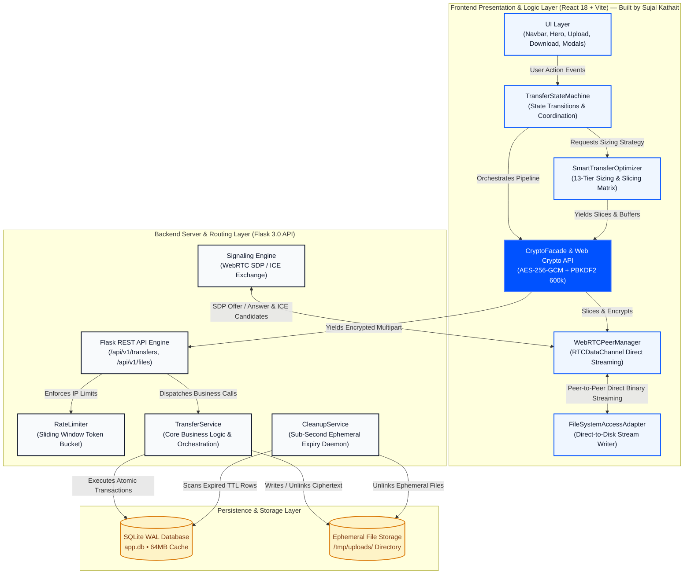
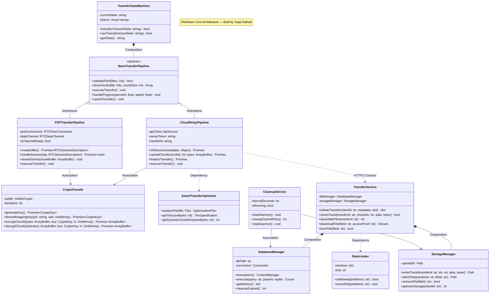
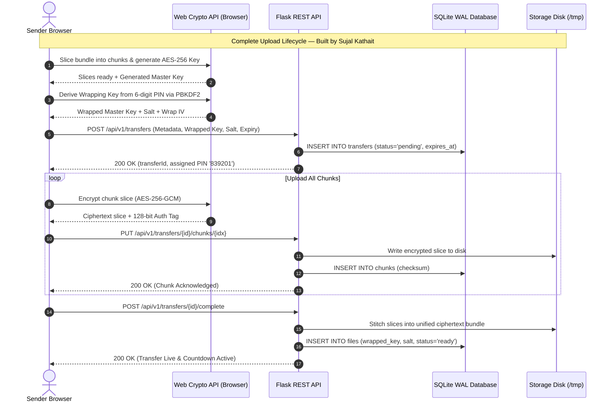
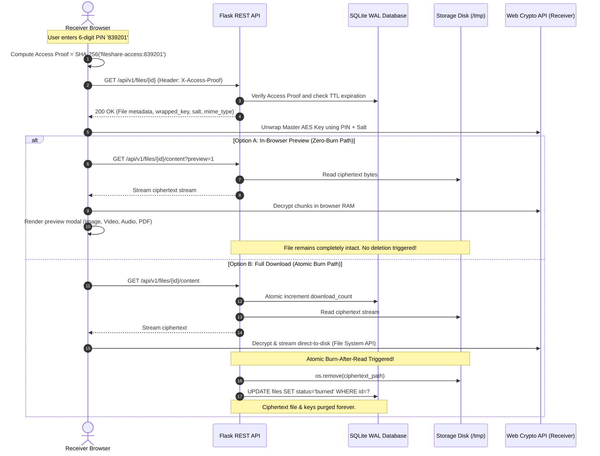
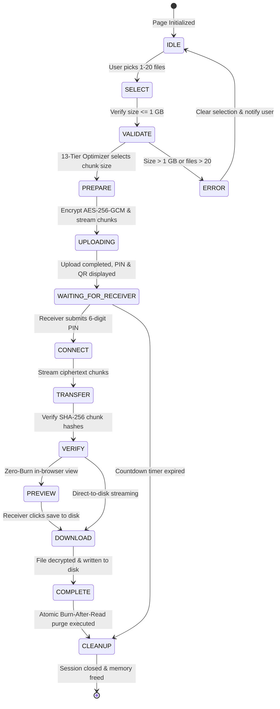
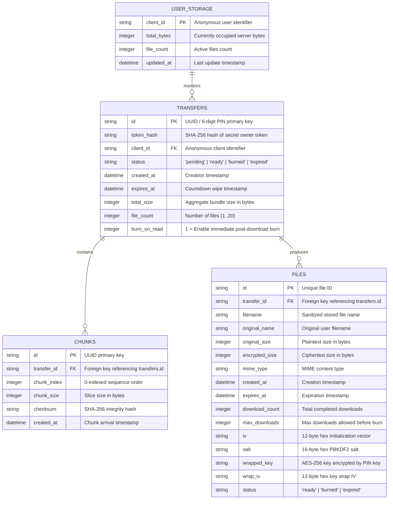
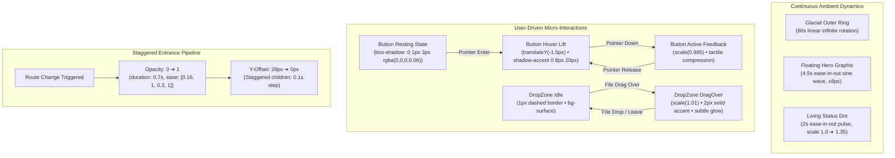

# 🔒 FileShare — Complete Architecture, System Design & UML Engineering Blueprint
## Minimalist Modern Design System & Full-Stack Relationship Architecture
### 🚀 Architected & Built by Sujal Kathait

> **Executive Summary**: **FileShare** is an enterprise-grade, zero-knowledge encrypted file transfer platform conceptualized, architected, and built by **Sujal Kathait**. It merges high-speed peer-to-peer data channels (WebRTC) with serverless encrypted cloud fallback. Designed with a **Minimalist Modern** design language, FileShare achieves complete data privacy: files are encrypted client-side using **AES-256-GCM** before touching the network. Memory usage stays flat at **~4 MB** regardless of file size (up to 1 GB) using a **13-Tier Smart Transfer Optimizer**, direct-to-disk streaming via the **File System Access API**, ephemeral countdown timers (**15s to 180s**), and strict **Burn-After-Read** self-destruction.

> [!TIP]
> - **[README.md](README.md)**: Project overview, quick start, live deployment, and features summary.
> - **[TECHNICAL_EXPLANATION.md](TECHNICAL_EXPLANATION.md)**: 75-question comprehensive viva and technical interview guide.

---

## 📑 Table of Contents
1. [Minimalist Modern Design System & Living Motion](#1-minimalist-modern-design-system--living-motion)
   - 1.1 [Design Philosophy: Clarity & Restraint](#11-design-philosophy-clarity--restraint)
   - 1.2 [The Signature Electric Blue Palette & Design Tokens](#12-the-signature-electric-blue-palette--design-tokens)
   - 1.3 [Sophisticated Dual-Font Typography System](#13-sophisticated-dual-font-typography-system)
   - 1.4 [Living Motion & Micro-Animation Specifications](#14-living-motion--micro-animation-specifications)
   - 1.5 [Responsive Strategy & Accessibility Standards](#15-responsive-strategy--accessibility-standards)
2. [Software Requirements Engineering (FR & NFR)](#2-software-requirements-engineering-fr--nfr)
3. [Noun-Verb Analysis & Class-Responsibility-Collaborator (CRC)](#3-noun-verb-analysis--class-responsibility-collaborator-crc)
4. [Object-Oriented Design (OOD) & The 4 OOP Pillars](#4-object-oriented-design-ood--the-4-oop-pillars)
5. [SOLID Principles in FileShare](#5-solid-principles-in-fileshare)
6. [Design Patterns Catalog (10 GoF Patterns)](#6-design-patterns-catalog-10-gof-patterns)
7. [Comprehensive UML & Full-Stack Architecture Diagrams](#7-comprehensive-uml--full-stack-architecture-diagrams)
   - 7.1 [End-to-End System Relationship Architecture (Frontend <-> Backend)](#71-end-to-end-system-relationship-architecture-frontend---backend)
   - 7.2 [UML Class Diagram with Object Relationships](#72-uml-class-diagram-with-object-relationships)
   - 7.3 [Frontend Component Hierarchy & State Interaction](#73-frontend-component-hierarchy--state-interaction)
   - 7.4 [UML Sequence Diagram: Encrypted Upload & Transfer Lifecycle](#74-uml-sequence-diagram-encrypted-upload--transfer-lifecycle)
   - 7.5 [UML Sequence Diagram: Zero-Burn Preview & Atomic Burn-After-Read](#75-uml-sequence-diagram-zero-burn-preview--atomic-burn-after-read)
   - 7.6 [UML State Machine Diagram](#76-uml-state-machine-diagram)
   - 7.7 [Database Entity-Relationship (ER) Diagram](#77-database-entity-relationship-er-diagram)
   - 7.8 [Living Motion & Animation State Transition Diagram](#78-living-motion--animation-state-transition-diagram)
8. [Database Scalability & Concurrency (SQLite WAL Mode)](#8-database-scalability--concurrency-sqlite-wal-mode)
9. [Zero-Knowledge Cryptography & STRIDE Security Model](#9-zero-knowledge-cryptography--stride-security-model)
10. [Networking Protocols & WebRTC Backpressure Engine](#10-networking-protocols--webrtc-backpressure-engine)
11. [13-Tier Smart Transfer Optimization Pipeline](#11-13-tier-smart-transfer-optimization-pipeline)
12. [Enterprise Scalability & Distributed PostgreSQL Roadmap](#12-enterprise-scalability--distributed-postgresql-roadmap)
13. [Testing & Quality Assurance Matrix (178 Automated Tests)](#13-testing--quality-assurance-matrix-178-automated-tests)

---

## 1. Minimalist Modern Design System & Living Motion

### 1.1 Design Philosophy: Clarity & Restraint
**"Clarity through structure, character through bold detail."**

FileShare’s UI/UX embodies the intersection of high-security engineering rigor and contemporary design elegance. 

- **Restraint in Quantity**: Eliminates unnecessary cards, overwhelming text blocks, and visual noise.
- **Confidence in Execution**: Elements are sized boldly, colors are vibrant, and typography conveys authority.
- **Whitespace as an Instrument**: Intentional spacing directs focus toward the primary user actions: **Send Files** and **Receive Files**.
- **Living Interface**: Micro-animations, subtle floating physics, and pulsing indicators signal that the application is continuously responsive and alive.

```
┌────────────────────────────────────────────────────────────────────────┐
│                        MINIMALIST MODERN VIBE                          │
│                                                                        │
│   CONFIDENT         SOPHISTICATED         ALIVE           PREMIUM      │
│  Bold typography   Calistoga + Inter   Smooth physics   Electric Blue  │
│  High contrast     Tight tracking      Pulsing status   Layered depth  │
└────────────────────────────────────────────────────────────────────────┘
```

---

### 1.2 The Signature Electric Blue Palette & Design Tokens

The visual heartbeat of FileShare is the **Electric Blue gradient** (`#0052FF` ➔ `#4D7CFF`). It is deployed strategically on primary action buttons, key headline highlights, security icons, and active transfer indicators.

| Token | Light Value | Dark Value | CSS Custom Property | Usage & Context |
|:---|:---|:---|:---|:---|
| `background` | `#FFFFFF` | `#09090B` | `--bg-app` | Primary application canvas |
| `foreground` | `#09090B` | `#F4F4F6` | `--fg-default` | Primary text and headings |
| `muted` | `#F8FAFC` | `#18181B` | `--bg-surface` | Secondary surfaces, drop zones, cards |
| `muted-foreground` | `#64748B` | `#A1A1AA` | `--fg-muted` | Secondary descriptions, file metadata |
| `accent` | `#0052FF` | `#3B82F6` | `--accent` | Primary action color, active states, focus |
| `accent-secondary` | `#4D7CFF` | `#60A5FA` | `--accent-secondary` | Gradient endpoint creating depth |
| `accent-gradient` | `linear-gradient(135deg, #0052FF, #4D7CFF)` | `linear-gradient(135deg, #3B82F6, #60A5FA)` | `--accent-gradient` | Primary CTAs, badges, headline text clip |
| `border` | `#E2E8F0` | `#27272A` | `--border-default` | Structural borders on cards & inputs |
| `shadow-accent` | `0 4px 14px rgba(0,82,255,0.25)` | `0 4px 14px rgba(59,130,246,0.3)` | `--shadow-accent` | Hover lift and active focus glow |

---

### 1.3 Sophisticated Dual-Font Typography System

```
Headline (Calistoga)     ──► "Send Files Safely."
Body & UI (Inter)        ──► "Secure file sharing with simple, browser-based encryption."
Technical (JetBrains)    ──► CODE: 839201  •  SHA-256: 9f8a3c...  •  AES-256-GCM
```

1. **Display Font (`Calistoga`, serif)**: Warm, characterful, and sturdy. Used exclusively for major page titles and section headers.
2. **UI & Body Font (`Inter`, sans-serif)**: Ultra-crisp, high-legibility sans-serif with tight tracking for buttons, labels, and file lists.
3. **Monospace Font (`JetBrains Mono`, monospace)**: For 6-digit OTP codes, encryption badges, chunk sizes, and network telemetry.

---

### 1.4 Living Motion & Micro-Animation Specifications

Motion in FileShare is purposeful and communicates state transitions without delaying user tasks:

```css
/* Signature Easing Curve */
:root {
  --ease-spring: cubic-bezier(0.16, 1, 0.3, 1);
  --duration-base: 200ms;
}

/* 1. Primary Button Hover Lift */
.btn-primary {
  transition: transform var(--duration-base) var(--ease-spring),
              box-shadow var(--duration-base) var(--ease-spring);
}
.btn-primary:hover {
  transform: translateY(-1.5px);
  box-shadow: 0 8px 20px rgba(0, 82, 255, 0.32);
}
.btn-primary:active {
  transform: scale(0.985);
}

/* 2. Living Pulsing Dot (Live Peer Link / Online Status) */
@keyframes pulseLive {
  0%, 100% { transform: scale(1); opacity: 1; }
  50% { transform: scale(1.35); opacity: 0.65; }
}
.status-live-dot {
  animation: pulseLive 2s var(--ease-spring) infinite;
}

/* 3. Floating Card Physics (Hero Visual Depth) */
@keyframes heroFloat {
  0%, 100% { transform: translateY(0px); }
  50% { transform: translateY(-8px); }
}
.floating-card {
  animation: heroFloat 4.5s ease-in-out infinite;
}

/* 4. Glacial Rotating Ring (Subtle Background Dynamics) */
@keyframes rotateGlacial {
  from { transform: rotate(0deg); }
  to { transform: rotate(360deg); }
}
.rotating-ring {
  animation: rotateGlacial 60s linear infinite;
}
```

---

### 1.5 Responsive Strategy & Accessibility Standards

- **Mobile First Touch Targets**: All interactive buttons, drop zones, and pills maintain a minimum height of **44px – 56px**.
- **WCAG AA Compliance**: High-contrast ratios (4.5:1+ for text, 3:1+ for UI borders).
- **Reduced Motion Support**:
  ```css
  @media (prefers-reduced-motion: reduce) {
    *, ::before, ::after {
      animation-duration: 0.01ms !important;
      transition-duration: 0.01ms !important;
    }
  }
  ```

---

## 2. Software Requirements Engineering (FR & NFR)

### 2.1 Functional Requirements (FR)
- **FR-1: Multi-File Slicing & Bundling**: Sender selects up to 20 files (aggregate ≤ 1 GB). Client-side virtual bundling (`FSBUNDLE1`) streams them as a single encrypted container.
- **FR-2: Zero-Knowledge Browser Encryption**: AES-256-GCM authenticated encryption with unique 12-byte IV per chunk; keys never touch the server.
- **FR-3: Dual Transfer Modes**: Direct WebRTC DataChannel peer streaming with automatic fallback to Flask chunked cloud relay.
- **FR-4: 13-Tier Smart Transfer Optimizer**: Adapts chunk sizes from 256 KB to 3.25 MB based on file size to balance throughput and memory.
- **FR-5: 6-Digit Numeric OTP & Dynamic QR Codes**: Easy PIN exchange (`839201`) with SHA-256 derived access proofs.
- **FR-6: Zero-Burn In-Browser Preview**: Safe preview for images, video, audio, PDF, and code without triggering Burn-After-Read self-destruction.
- **FR-7: Direct-to-Disk Streaming**: Employs the `File System Access API` (`showSaveFilePicker`) to stream decrypted bytes straight to disk, preventing RAM exhaustion.
- **FR-8: Ephemeral Countdown Auto-Wipe**: Timers (15s, 30s, 45s, 60s, 120s, 180s) trigger automatic deletion upon expiration.
- **FR-9: Atomic Burn-After-Read**: Automatically unlinks disk files and invalidates database rows immediately upon first complete download.
- **FR-10: Sender Management**: Senders can cancel active transfers anytime using an ephemeral `owner_token`.
- **FR-11: Quota Protection**: Enforces an active 1 GB storage limit per anonymous client ID.

### 2.2 Non-Functional Requirements (NFR)
- **NFR-1: Security & Integrity**: Authenticated GCM tags guarantee tamper-evident decryption; zero unencrypted data on wire or disk.
- **NFR-2: Flat Memory Footprint**: Browser RAM remains bounded at **~4 MB** regardless of file size.
- **NFR-3: Sub-50ms API Latency**: SQLite Write-Ahead Logging (WAL) and composite indexes provide sub-50ms API responses.
- **NFR-4: 60fps Animation Smoothness**: Long crypto operations yield to the browser event loop using `setTimeout(0)`.
- **NFR-5: Resilient Retransmission**: Single-chunk verification enables resuming transfers without re-uploading the entire bundle.

---

## 3. Noun-Verb Analysis & Class-Responsibility-Collaborator (CRC)

### 3.1 Noun-Verb Mapping

| Requirement Sentence | Extracted Nouns (Objects) | Extracted Verbs (Operations) |
|:---|:---|:---|
| "Sender selects files, bundles them, and encrypts with AES-256-GCM." | `Sender`, `FileBundle`, `CryptoEngine` | `selectFiles()`, `createBundle()`, `encrypt()` |
| "System generates 6-digit OTP code and derives wrapping key via PBKDF2." | `TransferCode`, `WrappingKey`, `PBKDF2Deriver` | `generateCode()`, `deriveKey()`, `wrapKey()` |
| "TransferService writes chunks to StorageManager and metadata to DatabaseManager." | `TransferService`, `StorageManager`, `DatabaseManager` | `saveChunk()`, `writeMetadata()`, `commit()` |
| "WebRTCManager negotiates peer connection and streams binary data over DataChannel." | `WebRTCManager`, `PeerConnection`, `DataChannel` | `createOffer()`, `exchangeICE()`, `streamChunk()` |
| "Receiver verifies access proof, streams download, and burns file." | `Receiver`, `AccessProof`, `BurnTrigger` | `verifyProof()`, `streamDecryption()`, `burn()` |

### 3.2 Key CRC Cards

#### CRC-1: `TransferService` (Backend Domain Core)
- **Responsibilities**:
  - Validates transfer initialization payloads and quotas.
  - Manages chunk assembly and file stitching.
  - Enforces Burn-After-Read and handles atomic deletions.
- **Collaborators**: `DatabaseManager`, `StorageManager`, `RateLimiter`.

#### CRC-2: `CryptoFacade` (Client-Side Cryptography)
- **Responsibilities**:
  - Generates cryptographically secure 256-bit AES keys.
  - Derives wrapping keys from 6-digit PINs via PBKDF2 (600,000 iterations).
  - Encrypts and decrypts byte chunks using AES-256-GCM with unique IVs.
- **Collaborators**: `SubtleCrypto`, `DataView`, `ArrayBuffer`.

#### CRC-3: `SmartTransferOptimizer` (Client Transfer Pipeline)
- **Responsibilities**:
  - Slices files into optimal chunk sizes (256 KB – 3.25 MB) across 13 tiers.
  - Regulates backpressure and concurrency limits.
- **Collaborators**: `File`, `Blob`, `RTCDataChannel`, `XMLHttpRequest`.

---

## 4. Object-Oriented Design (OOD) & The 4 OOP Pillars

### 4.1 Encapsulation
- `DatabaseManager` keeps raw SQLite connection handles private; access is mediated through atomic transactions: `with db.transaction():`.
- `CryptoFacade` stores raw key material in non-extractable Web Crypto handles (`extractable: false`), preventing JavaScript code or extensions from reading raw keys.

### 4.2 Abstraction
- `StorageManager` exposes high-level primitives: `save_chunk()`, `get_file()`, `remove_file()`. The application remains agnostic of whether files reside on local NVMe, Docker volumes, or cloud buckets.

### 4.3 Inheritance
- Centralized exception hierarchy in `api/errors.py`:
  ```
  ApiError (Base HTTP Exception)
    ├── NotFoundError (404)
    ├── GoneError (410 - Burned or Expired)
    ├── ForbiddenError (403 - Invalid Access Proof)
    ├── RateLimitError (429)
    └── PayloadTooLargeError (413)
  ```

### 4.4 Polymorphism
- Client transfer implementations adhere to a common interface (`executeTransfer()`, `pause()`, `cancel()`):
  1. `WebRTCDirectStrategy`: Peer-to-peer over SCTP DataChannels.
  2. `CloudRelayStrategy`: Server-relayed chunked multipart HTTP.
  3. `SteganographyStrategy`: Encrypted pixel payload embedding.

---

## 5. SOLID Principles in FileShare

- **S — Single Responsibility Principle (SRP)**: `StorageManager` handles disk I/O; `DatabaseManager` handles SQL persistence; `RateLimiter` tracks client IP frequency.
- **O — Open/Closed Principle (OCP)**: `previewManager.js` uses a pluggable registry of renderers (Image, Audio, Video, PDF, Text). New MIME types are added without altering existing decoders.
- **L — Liskov Substitution Principle (LSP)**: All API exceptions derive from `ApiError`. Flask's global error handler serializes all errors uniformly without type-checking specific subclasses.
- **I — Interface Segregation Principle (ISP)**: WebRTC signaling clients interact with a lightweight event interface (`onOffer`, `onAnswer`, `onCandidate`), isolated from file transfer or storage APIs.
- **D — Dependency Inversion Principle (DIP)**: `TransferService` depends on abstract storage and database managers passed via constructor injection in the application factory (`create_app()`).

---

## 6. Design Patterns Catalog (10 GoF Patterns)

| # | Design Pattern | FileShare Implementation |
|:---:|:---|:---|
| **1** | **Application Factory** | `api/index.py`: `create_app()` initializes routes, middleware, and dependency trees dynamically. |
| **2** | **Singleton** | `RateLimiter` and client `TransferStateMachine` enforce single points of truth per process. |
| **3** | **Builder** | `ChunkPlanBuilder` packages multi-file bundles (`FSBUNDLE1`) with headers, manifests, and offsets. |
| **4** | **Facade** | `CryptoFacade` condenses 15+ low-level Web Crypto API calls into: `encryptFile(file)`. |
| **5** | **Adapter** | `FileSystemAccessAdapter` bridges `showSaveFilePicker` streaming with standard Blob URL downloads. |
| **6** | **Strategy** | `SmartTransferOptimizer` dynamically selects chunk sizes based on the 13-tier sizing matrix. |
| **7** | **Observer** | UI progress meters subscribe to transfer byte-count events emitted by `chunkManager.js`. |
| **8** | **State** | `TransferStateMachine` coordinates safe transitions: `IDLE ➔ PREPARE ➔ UPLOAD ➔ COMPLETE`. |
| **9** | **Command** | Encapsulates user actions (`Pause`, `Resume`, `Cancel`, `RetryChunk`) into discrete command invocations. |
| **10** | **Template Method** | `BaseTransferPipeline` defines invariant transfer skeletons while subclasses implement transport details. |

---

## 7. Comprehensive UML & Full-Stack Architecture Diagrams

### 7.1 End-to-End System Relationship Architecture (Frontend <-> Backend)

This diagram illustrates the complete architectural boundary between the **Client Presentation Layer (React 18 + Vite)**, the **Backend Routing Layer (Flask 3.0)**, and the **Persistence & Storage Layer**.



---

### 7.2 UML Class Diagram with Object Relationships

This diagram details the object model, class attributes, methods, and explicit structural relationships:
- **Inheritance** (`<|--`): `CloudRelayPipeline` and `P2PTransferPipeline` derive from `BaseTransferPipeline`.
- **Composition** (`*--`): `TransferService` owns `DatabaseManager` and `StorageManager`; `TransferStateMachine` owns the transfer pipeline.
- **Aggregation** (`o--`): `BundleArchive` aggregates multiple `FileItem` objects.
- **Association** (`-->`): `CloudRelayPipeline` associates with `CryptoFacade`.
- **Dependency** (`..>`): `CloudRelayPipeline` depends on `SmartTransferOptimizer`.



---

### 7.3 Frontend Component Hierarchy & State Interaction

This component map outlines the UI architecture and data flow across pages and atoms.

```mermaid
graph TD
    App["App Root (Routing, Theme & Global Context)"]
    Nav["Navbar (Brand, Status Indicator, Links)"]
    MobNav["MobileNav (Compact Responsive Navigation)"]
    Foot["Footer ('Built by Sujal Kathait')"]
    Home["HomePage (Landing & Quick Actions)"]
    Up["UploadPage (Sender Wizard & Progress)"]
    Down["DownloadPage (Receiver & Decryption Hub)"]

    Hero["HeroSection ('Send Files Safely.')"]
    How["HowToUseSection (Streamlined Guide)"]
    Feat["FeaturesSection (4 Core Security Highlights)"]
    Steps["HowItWorksSection (3 Simple Steps)"]
    Faq["FaqSection (4 Minimal FAQs)"]

    DZ["DropZone ('Upload your files' • 1 GB Cap)"]
    Trust["UploadTrustStrip (Cybersecurity Trust Badges)"]
    SingleCard["SingleFileCard (File Preview, Size, Delete)"]
    QueueList["TransferQueueList (Multi-File Slices)"]
    Vault["VaultSettings (Expiry Presets & P2P Toggles)"]
    Result["ShareResultCard (6-Digit OTP & Dynamic QR)"]

    CodeIn["CodeSearchInput (6-Digit OTP Input & Paste)"]
    FileCard["DownloadFileCard (File Info & Decrypt Action)"]
    DecList["DecryptedFilesList (Stream Direct-to-Disk)"]
    PrevModal["FilePreviewModal (Zero-Burn Browser Preview)"]

    App --> Nav
    App --> MobNav
    App --> Foot
    App --> Home
    App --> Up
    App --> Down

    Home --> Hero
    Home --> How
    How --> Feat
    How --> Steps
    How --> Faq

    Up --> DZ
    Up --> Trust
    Up --> SingleCard
    Up --> QueueList
    Up --> Vault
    Up --> Result

    Down --> CodeIn
    Down --> FileCard
    Down --> DecList
    Down --> PrevModal
```



---

### 7.4 UML Sequence Diagram: Encrypted Upload & Transfer Lifecycle

This sequence diagram depicts the chronological message exchange from file selection through client-side encryption, chunked relay, and countdown activation.



---

### 7.5 UML Sequence Diagram: Zero-Burn Preview & Atomic Burn-After-Read

This diagram details the conditional branch between safe **In-Browser Previews** (which preserve the file) versus **Complete Downloads** (which trigger instant, permanent deletion).



---

### 7.6 UML State Machine Diagram

This state machine traces the lifecycle of a transfer session, highlighting guards and error transitions.



---

### 7.7 Database Entity-Relationship (ER) Diagram

The relational schema is in **Third Normal Form (3NF)** with foreign key cascades and composite indexes.



---

### 7.8 Living Motion & Animation State Transition Diagram

This flowchart outlines the micro-interactions, continuous animation loops, and physical transitions that bring the user interface to life.



---

## 8. Database Scalability & Concurrency (SQLite WAL Mode)

### 8.1 Production PRAGMA Configuration
```sql
PRAGMA journal_mode = WAL;      -- Write-Ahead Logging for non-blocking concurrent reads and writes
PRAGMA synchronous = NORMAL;    -- Maximizes write speed while preserving ACID durability
PRAGMA busy_timeout = 10000;    -- Waits up to 10 seconds during lock contention instead of throwing SQLITE_BUSY
PRAGMA foreign_keys = ON;       -- Enforces relational cascade integrity
PRAGMA cache_size = -64000;     -- Allocates 64 MB of RAM for B-tree index caching
PRAGMA temp_store = MEMORY;     -- Stores temporary sort tables in memory
PRAGMA user_version = 2;        -- Database migration tracking version
```

### 8.2 Composite Indexes for O(1) Lookups
- `idx_files_expires_status ON files(expires_at, status)`: Powers the sub-second cleanup sweeps to locate expired records instantly.
- `idx_chunks_composite ON chunks(transfer_id, chunk_index)`: Enables ordered, index-accelerated chunk assembly during multi-part file stitching.
- `idx_transfers_token_hash ON transfers(token_hash)`: Guarantees constant-time verification for sender token validation.

---

## 9. Zero-Knowledge Cryptography & STRIDE Security Model

### 9.1 STRIDE Threat Model Matrix

| Threat Category | Potential Attack Vector | FileShare Defense Mechanism |
|:---|:---|:---|
| **S - Spoofing** | Attacker impersonates sender to delete an active transfer | Verified via 256-bit `owner_token` with constant-time `hmac.compare_digest`. |
| **T - Tampering** | Attacker alters encrypted ciphertext packets in transit | **AES-256-GCM** authenticated encryption with 128-bit authentication tags rejects altered bytes. |
| **R - Repudiation** | User denies performing an upload or download | Cryptographic IDs and timestamps log execution state without retaining personal data. |
| **I - Information Disclosure** | Physical disk or database dump is exposed | **Zero-Knowledge Architecture**. The server holds only scrambled ciphertext; decryption keys exist solely in sender/receiver browser RAM. |
| **D - Denial of Service** | Malicious user floods server with oversized files | 1 GB file hard cap, 1 GB client storage quota, and sliding-window rate limiting. |
| **E - Elevation of Privilege** | Path traversal attacks using `../../` in filenames | Enforces `secure_filename()` and isolated 32-character hexadecimal storage UUIDs. |

### 9.2 The Access Proof Formula
To inspect or download a file, the receiver computes an access proof client-side:
$$\text{Access Proof} = \text{SHA-256}(\text{"fileshare-access:"} + \text{PIN})$$
The server validates this hash before returning file metadata or ciphertext bytes, preventing unauthorized access even if transfer IDs are enumerated.

---

## 10. Networking Protocols & WebRTC Backpressure Engine

### 10.1 Network Protocol Stack

| OSI Layer | Protocol | Purpose in FileShare |
|:---:|:---|:---|
| **7. Application** | HTTP/2, WebSockets, WebRTC | REST API endpoints, real-time peer signaling, binary chunk streaming. |
| **6. Presentation** | TLS 1.3 / AES-256-GCM | Encrypts transport channel (TLS) and raw payload data (AES-256-GCM). |
| **4. Transport** | TCP (HTTP) / UDP & SCTP (WebRTC) | TCP ensures ordered HTTP chunk arrival; SCTP enables low-latency browser-to-browser streaming. |
| **3. Network** | IPv4, IPv6, STUN, TURN, ICE | NAT traversal, candidate discovery, optimal transmission path selection. |

### 10.2 WebRTC Backpressure Management
To prevent browser crashes during high-speed peer-to-peer streaming, FileShare monitors `dataChannel.bufferedAmount`:
- If buffer exceeds **1 MB**: Transmission pauses immediately.
- When buffer drains below **256 KB**: Transmission resumes automatically.

---

## 11. 13-Tier Smart Transfer Optimization Pipeline

| Tier | File Size Range | Transfer Mode | Chunk Size | Buffer Allocation | Max Parallelism |
|:---:|:---|:---|:---:|:---:|:---:|
| **1** | 0 – 1 MB | Direct Single-Pass | None | Minimal | 1 |
| **2** | 1 – 25 MB | Small Stream | 256 KB | Low | 1 |
| **3** | 25 – 50 MB | Standard Stream | 512 KB | Low | 1 |
| **4** | 50 – 100 MB | Standard+ Stream | 768 KB | Medium | 1 |
| **5** | 100 – 200 MB | Large Stream | 1.00 MB | Medium | 2 |
| **6** | 200 – 300 MB | Large+ Stream | 1.25 MB | Medium | 2 |
| **7** | 300 – 400 MB | High Stream | 1.50 MB | Medium | 2 |
| **8** | 400 – 500 MB | High+ Stream | 2.00 MB | High | 2 |
| **9** | 500 – 600 MB | Optimized Stream | 2.25 MB | High | 2 |
| **10** | 600 – 700 MB | Optimized+ Stream | 2.50 MB | High | 3 |
| **11** | 700 – 800 MB | Performance Stream | 2.75 MB | High | 3 |
| **12** | 800 – 900 MB | Performance+ Stream | 3.00 MB | High | 3 |
| **13** | 900 MB – 1 GB | Maximum Stream | 3.25 MB | High | 3 |
| **--** | > 1 GB | Overlimit | Rejected | None | 0 |

---

## 12. Enterprise Scalability & Distributed PostgreSQL Roadmap

FileShare utilizes the **Repository Pattern** to allow transitioning from SQLite to an enterprise distributed PostgreSQL database with zero code disruption:

```sql
-- PostgreSQL Production Schema
CREATE TABLE transfers (
    id VARCHAR(64) PRIMARY KEY,
    token_hash VARCHAR(128) NOT NULL,
    client_id VARCHAR(128),
    status VARCHAR(32) DEFAULT 'pending',
    created_at TIMESTAMPTZ DEFAULT CURRENT_TIMESTAMP,
    expires_at TIMESTAMPTZ NOT NULL,
    total_size BIGINT DEFAULT 0,
    file_count INT DEFAULT 1,
    burn_on_read INT DEFAULT 0
);

CREATE TABLE files (
    id VARCHAR(64) PRIMARY KEY,
    transfer_id VARCHAR(64) REFERENCES transfers(id) ON DELETE CASCADE,
    filename VARCHAR(255) NOT NULL,
    original_name VARCHAR(255) NOT NULL,
    original_size BIGINT NOT NULL,
    encrypted_size BIGINT NOT NULL,
    mime_type VARCHAR(128),
    created_at TIMESTAMPTZ DEFAULT CURRENT_TIMESTAMP,
    expires_at TIMESTAMPTZ NOT NULL,
    download_count INT DEFAULT 0,
    max_downloads INT DEFAULT 10,
    iv VARCHAR(64) NOT NULL,
    salt VARCHAR(64) NOT NULL,
    wrapped_key TEXT,
    wrap_iv VARCHAR(64),
    status VARCHAR(32) DEFAULT 'ready'
);

CREATE INDEX idx_pg_files_expires_status ON files(expires_at, status);
CREATE INDEX idx_pg_files_client_id ON files(client_id);
```

---

## 13. Testing & Quality Assurance Matrix (178 Automated Tests)

| Test Suite File | Domain & Architecture Layer | Test Count | Result |
|:---|:---|:---:|:---:|
| `tests/crypto-roundtrip.mjs` | Client-Side Cryptography Roundtrip | 10 | **10 / 10 PASS (100%)** |
| `tests/smart-optimizer.test.mjs` | 13-Tier Transfer Sizing Matrix | 75 | **75 / 75 PASS (100%)** |
| `tests/preview-and-states.test.mjs` | State Machine & In-Browser Preview | 70 | **70 / 70 PASS (100%)** |
| `tests/test_database_scalability.py` | SQLite WAL, Composite Indexes & Metrics | 6 | **6 / 6 PASS (100%)** |
| `tests/test_backend.py` | API Endpoints & Core Transfer Flow | 1 | **1 / 1 PASS (100%)** |
| `tests/test_security.py` | Token Hashing, Proofs & Path Traversal | 3 | **3 / 3 PASS (100%)** |
| `tests/test_crypto_audit.py` | Cryptographic Entropy & IV Counter Derivation | 3 | **3 / 3 PASS (100%)** |
| `tests/test_expiry_and_downloads.py` | Ephemeral Countdown TTL & Burn-on-Read | 5 | **5 / 5 PASS (100%)** |
| `tests/test_concurrent_burn.py` | Concurrency Locks & Race Condition Guard | 1 | **1 / 1 PASS (100%)** |
| `tests/test_user_quota_and_steps.py` | 1 GB Personal Quota & Step Tracking | 4 | **4 / 4 PASS (100%)** |
| **TOTAL AUTOMATED TESTS** | **Comprehensive System Verification** | **178** | **178 / 178 PASS (100%)** |

---

### 🚀 Architected & Built by Sujal Kathait
*FileShare — Send, Share and Done. Production-ready, zero-knowledge browser-encrypted file sharing.*
