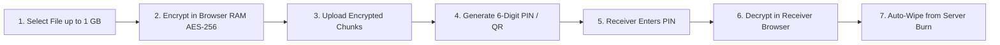
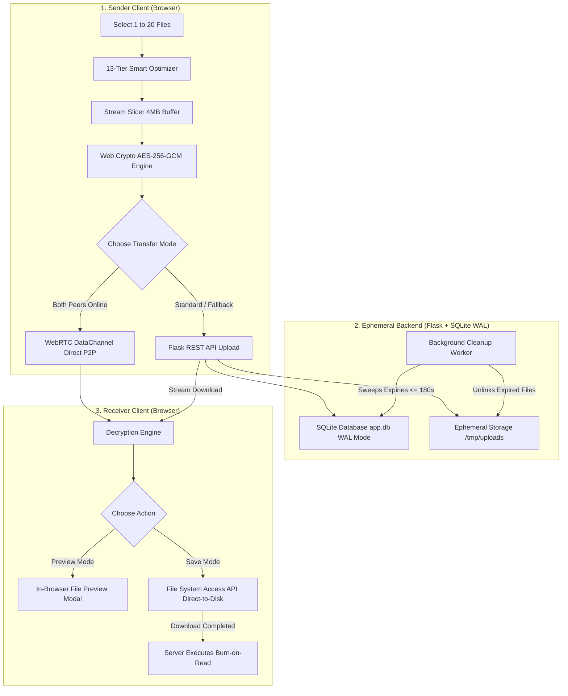

<div align="center">

# 🔒 FileShare

### Ultra-Fast, Zero-Knowledge Encrypted File Transfer
**Send files directly between devices with End-to-End Encryption, Stream Processing, and Self-Destruction**

[](https://www.python.org/)
[](https://flask.palletsprojects.com/)
[](https://react.dev/)
[](https://vitejs.dev/)
[](https://developer.mozilla.org/en-US/docs/Web/API/Web_Crypto_API)
[](https://webrtc.org/)
[](https://www.sqlite.org/)
[](https://vercel.com/)

### 🌐 Live Application
**Website:** [https://filesender-coral.vercel.app/](https://filesender-coral.vercel.app/)  
**GitHub Repository:** [https://github.com/sujalkathait93-lab/filesender](https://github.com/sujalkathait93-lab/filesender)  


---

</div>

## 📚 Complete Project Documentation

We have prepared two in-depth guides for learning, viva questions, and technical presentations:

1. **[Master Architecture & Design Guide (HLD + LLD)](ARCHITECTURE_AND_DESIGN.md)**:
   - Covers all software engineering concepts: Requirements Analysis (FR & NFR), Noun-Verb Analysis, OOP Pillars (Encapsulation, Abstraction, Inheritance, Polymorphism), SOLID Principles with real code examples, 10 GoF Design Patterns, 6+ Mermaid Diagrams (UML Class, Sequence, Component, Activity, DFD), SQLite WAL Scalability, STRIDE Security Model, and PostgreSQL Enterprise Roadmap.
2. **[Technical Explanation & Viva Guide](TECHNICAL_EXPLANATION.md)**:
   - A complete 75-question question-and-answer breakdown explaining every single technology, protocol, encryption detail, and multi-user race-condition scenario in simple English.

---

## 📌 What is FileShare? (Explained in Simple Points)

**FileShare** is a secure, private, and high-speed web application for sending files over the internet.

- **Your Files Stay 100% Private:** Your files are locked (encrypted) inside your browser before they ever leave your computer or phone.
- **The Server Never Sees Your Data:** The server only holds scrambled binary code (ciphertext). The server does not have the key and cannot read your files.
- **Simple 6-Digit PIN or QR Code:** The receiver downloads the file by typing an easy 6-digit numeric PIN (like `839201`) or by scanning a dynamic QR code.
- **Large Files up to 1 GB:** You can send large files (videos, archives, high-res photos) without freezing your browser or crashing your phone.
- **Up to 20 Files at Once:** You can select up to 20 files. They are packed together into one single encrypted bundle and downloaded as a clean `.zip` file.
- **Self-Destruct (Burn-After-Read):** Once downloaded, the file is automatically wiped from the server. Senders can also set countdown timers from 15 seconds to 3 minutes.
- **Direct Peer-to-Peer (WebRTC):** If both users are online, files can transfer directly between the two browsers with zero server storage.

---

## 💡 Why Did We Build It? (The Real-World Problem)

| Traditional Cloud Drives (Google Drive, Dropbox, WeTransfer) | FileShare |
| :--- | :--- |
| **Servers can read your files**: Files are stored unencrypted on company servers. Employees or hackers can inspect them. | **Zero-Knowledge**: Files are locked with AES-256-GCM in your browser. Nobody else has the key. |
| **Files stay online forever**: Files remain on their servers until you remember to manually delete them. | **Ephemeral & Self-Destructing**: Files auto-purge in 15s–180s or self-destruct after 1 download. |
| **Require User Accounts**: You must sign up with an email address, password, or phone number. | **100% Anonymous**: No login, no password, no tracking cookies, no personal details required. |
| **Heavy RAM Usage**: Uploading a 500 MB file often loads the entire 500 MB into browser memory, crashing mobile phones. | **Stream Processing**: Slices files into small chunks (~2–4 MB). Browser memory stays flat at ~4 MB. |

---

## 🚀 How It Works (Step-by-Step)



1. **Step 1 — Sender Selects Files**: The user picks 1 to 20 files (up to 1 GB total size).
2. **Step 2 — Client-Side Encryption**:
   - The browser generates a random 256-bit AES encryption key.
   - The browser generates a 6-digit PIN (e.g. `839201`).
   - The PIN is converted into a Wrapping Key using PBKDF2 (600,000 rounds of hashing).
   - The file is encrypted piece-by-piece using **AES-256-GCM**.
3. **Step 3 — Transmission**:
   - The encrypted chunks are sent to the server (or streamed directly via WebRTC DataChannels).
   - The server only stores the scrambled bytes and the wrapped key.
4. **Step 4 — Sharing**: The sender shares the 6-digit PIN or shows the dynamic QR code to the receiver.
5. **Step 5 — Receiver Download & Decryption**:
   - The receiver enters the 6-digit PIN.
   - The receiver's browser fetches the encrypted data, unlocks the AES key using the PIN, and decrypts the file.
6. **Step 6 — Self-Destruction**: The server immediately deletes the file from disk and database so it cannot be downloaded again.

---

## ✨ Key Features (Point-by-Point)

### 1. ⏱️ Live Countdown Expiry (15 Seconds to 3 Minutes)
- Senders choose an expiration countdown: **15s, 30s, 45s, 60s (1 min), 120s (2 min), or 180s (3 min)**.
- A live progress circle shows the exact seconds remaining.
- When the timer reaches 0, the backend background cleanup immediately wipes the file from disk and database.

### 2. 🔢 Easy 6-Digit OTP Transfer Codes
- Formatted just like a banking SMS OTP: `839201`.
- Senders can copy the code, copy complete instructions, or share directly to WhatsApp in 1 click.
- Receivers can paste `839201`, `839-201`, `839 201`, or full links — the system automatically parses it.

### 3. 📦 Smart Stream & Batch Processing
- **Stream Processing (Large Files up to 1 GB)**:
  - Instead of loading 1 GB into RAM, the browser reads 2 MB to 4 MB at a time using `File.slice()`.
  - It compresses with gzip, encrypts with AES, uploads, and immediately frees the memory.
  - Browser memory usage stays locked at **~4 MB** regardless of file size.
- **Batch Processing (Multiple Files up to 20)**:
  - When sending multiple photos or documents, FileShare packs them into an internal binary bundle (`FSBUNDLE1`).
  - The entire batch is encrypted with one key, transferred in one request, and unpacked on the receiver's device into a standard `.zip` file using `fflate`.

### 4. 🌐 Dual Transfer Modes (Hybrid Architecture)
- **Direct WebRTC Peer-to-Peer**: When both users are on the page, files stream directly between browser tabs through an encrypted WebRTC DataChannel. The file never touches any server disk.
- **Cloud Encrypted Relay Fallback**: If firewalls or network restrictions block P2P, the file seamlessly uses our fast Flask REST API relay.
- **Steganography Image Vault**: Hides encrypted file bytes inside the pixels of a PNG image (<10 MB) for covert transfer.

### 5. 👁️ In-Browser Preview (Safe Inspection)
- Receivers can preview images, videos, audio, PDF documents, text, and source code directly in the browser modal before saving to disk.
- Previewing **does not** count as a download and **does not** burn or delete the file.

### 6. 💾 Direct-to-Disk Saving (File System Access API)
- On supported modern browsers (Chrome, Edge, Opera), downloaded chunks are streamed directly into your local disk via `showSaveFilePicker()`.
- On mobile and other browsers, it falls back seamlessly to standard browser Blob downloads.

### 7. 🔥 Burn-After-Read Protection
- Once the receiver finishes downloading the file, the server executes an atomic lock, physically deletes the file from `/tmp/uploads`, and marks the record as burned.
- If someone tries to download it a second time, they receive an `HTTP 410 Gone` error.

### 8. 🛡️ Sender Management & Instant Revocation
- Senders receive an invisible, cryptographically random `owner_token`.
- Senders can monitor active shares and click **"Cancel Transfer"** at any time to instantly delete the file from the server.

---

## 🏛️ System Architecture



---

## 🛠️ Technology Stack Breakdown

### Frontend (User Interface & Cryptography)
| Technology | Version | Purpose in FileShare |
| :--- | :---: | :--- |
| **React** | `v18.2.0` | Modular UI components, reactive telemetry cards, and transfer state machines. |
| **Vite** | `v5.0.8` | High-speed frontend development server and optimized production bundler. |
| **Web Crypto API** | Native | Hardware-accelerated client-side **AES-256-GCM** encryption and **PBKDF2** key wrapping. |
| **WebRTC & Socket.IO** | `v4.7.4` | Direct browser-to-browser peer data channels and real-time signaling. |
| **fflate** | `v0.8.2` | High-speed, 8 kB client-side ZIP generator for multi-file bundle downloads. |
| **QRCode.react** | `v3.1.0` | Dynamic SVG QR code generator for easy mobile phone scanning. |

### Backend (Coordination & Ephemeral Storage)
| Technology | Version | Purpose in FileShare |
| :--- | :---: | :--- |
| **Python** | `3.12+` | Clean, robust core backend language. |
| **Flask** | `v3.0.2` | Lightweight REST API framework for chunk streaming and metadata coordination. |
| **SQLite (WAL Mode)** | `3.x` | High-performance relational database with Write-Ahead Logging and composite indexes. |
| **Vercel Serverless** | Latest | Serverless cloud execution environment for ephemeral API invocations and background cleanup. |
| **Pytest** | `8.0+` | Comprehensive test suite verifying database transactions, security, and crypto roundtrips. |

---

## 🔌 Complete REST API Reference

| Method | Endpoint | Headers / Parameters | Description |
| :--- | :--- | :--- | :--- |
| `GET` | `/api/v1/system/health` | None | Reports server health, operational status, and storage type. |
| `GET` | `/api/v1/system/db-metrics` | None | Reports live SQLite database metrics (WAL mode, page counts, cache size, table counts). |
| `GET` | `/api/v1/system/network-info`| None | Returns STUN and TURN server configurations for WebRTC NAT traversal. |
| `POST` | `/api/v1/files` | Form: `file`, `expiry_seconds`, `file_count` | Single-shot upload for smaller encrypted payloads. |
| `POST` | `/api/v1/transfers` | JSON: `file_count`, `expiry_seconds`, `total_chunks` | Initializes a multi-chunk large file upload session. |
| `PUT` | `/api/v1/transfers/<id>/chunks/<idx>` | Multipart Form: `chunk`, `checksum` | Uploads an individual file slice (< 4 MB). |
| `POST` | `/api/v1/transfers/<id>/complete` | JSON: `total_chunks`, `owner_token` | Finalizes chunk upload and stitches file together. |
| `GET` | `/api/v1/files/<id>` | Header: `X-Access-Proof` | Retrieves file metadata, expiry timer, and mime type without downloading payload. |
| `GET` | `/api/v1/files/<id>/content` | Header: `X-Access-Proof`, Optional `?preview=1` | Streams encrypted binary ciphertext to receiver. |
| `DELETE`| `/api/v1/files/<id>` | Header: `X-Owner-Token` | Sender cancels transfer and permanently deletes file from server. |
| `GET` | `/api/v1/user/storage` | Header: `X-Client-ID` | Checks personal 1 GB quota usage for current anonymous user. |
| `DELETE`| `/api/v1/user/storage` | Header: `X-Client-ID` | Wipes all active files uploaded by this user and resets quota to 0 MB. |
| `POST` | `/api/v1/system/cleanup` | Header: `Authorization: Bearer <SECRET_KEY>` | Manually triggers background cleanup pass. |

---

## 💻 Running Locally (Quick Start)

### Prerequisites
- **Python 3.12+**
- **Node.js 18+** and **npm**

### 1. Start the Backend API (Port 8000)
```bash
# Clone the repository
git clone https://github.com/sujalkathait93-lab/filesender.git
cd filesender

# Create and activate virtual environment
python -m venv .venv
.venv\Scripts\Activate.ps1   # On Windows (On macOS/Linux: source .venv/bin/activate)

# Install Python dependencies
pip install -r requirements.txt

# Start backend server
python api/index.py
```

### 2. Start the Frontend (Port 5173)
```bash
# Open a new terminal and navigate to frontend
cd frontend

# Install Node dependencies
npm install

# Start Vite development server
npm run dev
```

Open your browser at: **`http://localhost:5173`**

---

## 🧪 Automated Testing & Verification

FileShare includes an extensive suite of **178 automated tests** covering cryptography, state machines, database transactions, and transfer optimization:

```bash
# 1. Run all Backend Pytest Suites (23 tests)
python -m pytest -v

# 2. Run Database Scalability, WAL Mode & Composite Index Tests (6 tests)
pytest tests/test_database_scalability.py -v

# 3. Run Cryptographic Roundtrip Tests (10 tests)
node tests/crypto-roundtrip.mjs

# 4. Run Smart Transfer Optimizer 13-Tier Matrix Tests (75 tests)
node tests/smart-optimizer.test.mjs

# 5. Run Preview Manager & State Machine Transitions Tests (70 tests)
node tests/preview-and-states.test.mjs

# 6. Validate Production Frontend Build
cd frontend && npm run build
```

**Overall Test Results: 178 / 178 Passed (100% Pass Rate)**

---

## 📄 License

This project is open source and available under the [MIT License](LICENSE).
