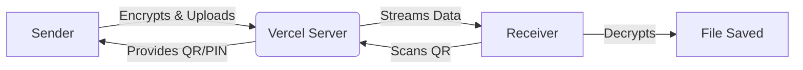

# 🚀 FileShare

FileShare is a secure, high-performance web app. It lets you send files to anyone instantly over the internet using a simple 6-digit PIN or by scanning a QR code.

---

## 🌟 Key Features

### 🔒 End-to-End Encryption
Your files are locked mathematically inside your browser before sending. Only the receiver's PIN can unlock them. The server never sees your actual files or passwords.

### 📦 Chunking for Large Files
Instead of sending a massive 1GB file at once, the browser slices it into tiny 4MB pieces. This prevents memory crashes and makes uploads incredibly fast.

### 🗂️ Multi-File Batching
When you send 50 photos, FileShare groups them into one single virtual bundle. This saves time, reduces network traffic, and speeds up the entire transfer process significantly.

### 📱 QR-Based Transfer
Receivers don't need to type long links. They just scan the QR code on the sender's screen using their phone camera, and the download starts securely and instantly.

### 🔥 Burn-on-Read
For ultimate privacy, the server deletes your file permanently the exact second the receiver finishes downloading it. No traces, no logs, and no backups are left behind.

### 🎨 Beautiful UI/UX
The design is sleek and modern. It uses glowing cards, live progress bars, animated countdown timers, and instant copy buttons to make sharing files effortless and visually stunning.

---

## 🏗️ Architecture & Workflows

### Upload Workflow
1. You select a file. 
2. Browser encrypts it locally. 
3. File is sliced into chunks and sent to the server. 
4. You get a PIN and QR code to share.

### Download Workflow
1. Receiver enters the PIN. 
2. Server streams the encrypted chunks back. 
3. Receiver's browser decrypts and rebuilds the file. 
4. The file is saved directly to their device.

### Architecture Flowchart

---

## ⚠️ Limitations & Edge Cases

- **Size Limits:** You can send up to 1 GB or 20 files at a time.
- **Network Drops:** If the internet disconnects mid-transfer, the system halts safely without corrupting data.
- **Expiration:** If nobody downloads the file, a background robot permanently deletes it after a set time.

---

## 💻 Tech Stack (MVP)

- **Frontend:** React (v18), Vite (v5), WebCrypto API, WebRTC.
- **Backend:** Python (v3.12), Flask (v3), SQLite3 (WAL mode).
- **Deployment:** Vercel Serverless Functions with ephemeral `/tmp` storage.

---

## 🔌 API Reference (v1)

- `POST /api/v1/transfers` - Start a large chunked transfer.
- `PUT /api/v1/transfers/<id>/chunks/<idx>` - Upload a 4MB slice.
- `GET /api/v1/files/<id>/content` - Download the encrypted file stream.
- `DELETE /api/v1/files/<id>` - Delete the file instantly.
