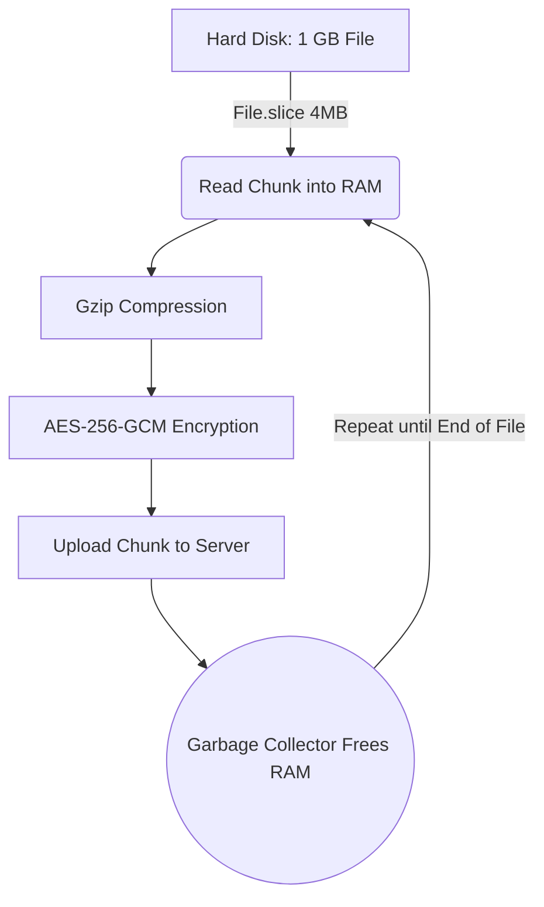
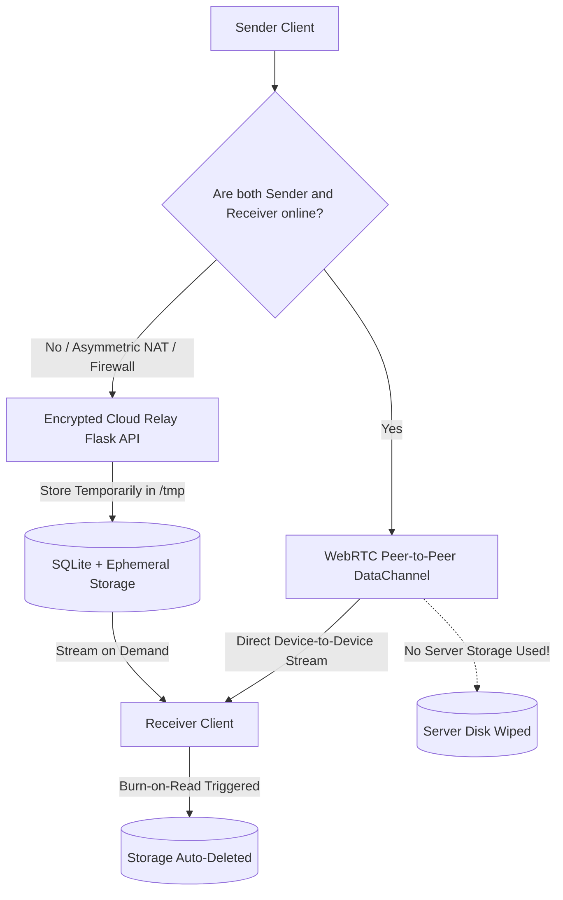
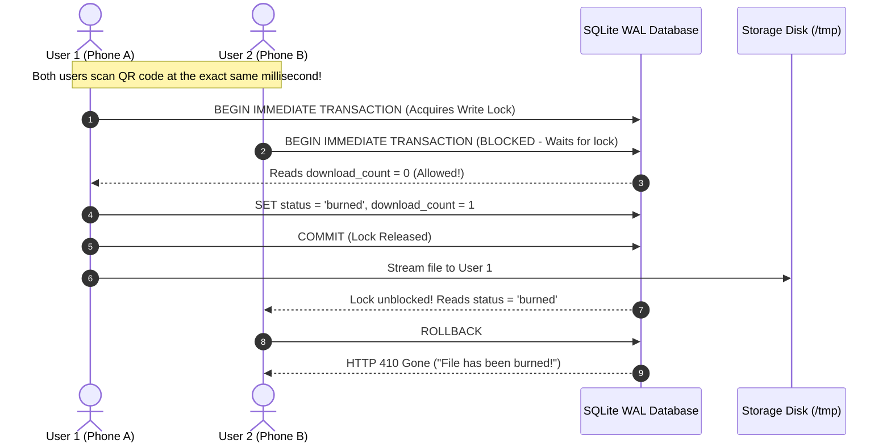

# FileShare Project — Complete Technical Explanation & Viva Guide
### Master Reference for Project Presentations, Technical Vivas, and Deep Learning
### 🚀 Architected & Built by Sujal Kathait

> [!TIP]
> - **[README.md](README.md)**: Main project overview, features, setup, and live demo.
> - **[ARCHITECTURE_AND_DESIGN.md](ARCHITECTURE_AND_DESIGN.md)**: Formal Software Engineering High-Level Design (HLD), Low-Level Design (LLD), UML Diagrams (Class, Sequence, Component, Activity, DFD), and GoF Design Patterns.

---

## 📑 Table of Contents
1. [Project Overview & Real-World Problem Solved](#1-project-overview--real-world-problem-solved)
2. [End-to-End Encryption & The "Key Vault" Mechanism](#2-end-to-end-encryption--the-key-vault-mechanism)
3. [Stream Processing (How FileShare Handles 1 GB Files Without Crashing RAM)](#3-stream-processing-how-fileshare-handles-1-gb-files-without-crashing-ram)
4. [Batch Processing & Multi-File Bundling (FSBUNDLE1 & Client-Side ZIP)](#4-batch-processing--multi-file-bundling-fsbundle1--client-side-zip)
5. [Dual Transfer Architecture: WebRTC Direct P2P vs. Cloud Relay](#5-dual-transfer-architecture-webrtc-direct-p2p-vs-cloud-relay)
6. [Database Scalability, SQLite WAL Mode & Concurrency](#6-database-scalability-sqlite-wal-mode--concurrency)
7. [Multi-User Scenarios & Race Condition Handling](#7-multi-user-scenarios--race-condition-handling)
8. [Network Stack & OSI / TCP-IP Model Mapping](#8-network-stack--osi--tcp-ip-model-mapping)
9. [Security Defenses & Threat Modeling (STRIDE)](#9-security-defenses--threat-modeling-stride)
10. [In-Browser File Preview & File System Access API](#10-in-browser-file-preview--file-system-access-api)
11. [Steganography Image Vault (Concealing Files in Pixels)](#11-steganography-image-vault-concealing-files-in-pixels)
12. [Complete End-to-End Transmission Walkthrough](#12-complete-end-to-end-transmission-walkthrough)
13. [Top 75 Viva Questions & Answers (Comprehensive Examiner Cheat Sheet)](#13-top-75-viva-questions--answers-comprehensive-examiner-cheat-sheet)

---

## 1. Project Overview & Real-World Problem Solved

### 1.1 What is FileShare?
- **Definition**: FileShare is a high-speed, zero-knowledge, encrypted file transfer web application.
- **How it functions**: Users select files in their browser, the files are locked with military-grade encryption inside browser RAM, and the receiver downloads the files using a simple 6-digit PIN (`839201`) or dynamic QR code.
- **Zero Storage Footprint**: Files self-destruct immediately after download (Burn-After-Read) or auto-purge when their countdown timer expires (15 seconds to 3 minutes).

### 1.2 The Real-World Problems FileShare Solves
1. **Privacy & Surveillance**:
   - *Traditional Cloud (Google Drive, Dropbox, WeTransfer)*: Your files sit unencrypted on company servers. Employees, automated scanners, or hackers who breach the database can read your private photos, contracts, and documents.
   - *FileShare Solution*: True **Zero-Knowledge**. The encryption key is generated in your browser and never leaves your device. The server only sees scrambled gibberish (`ciphertext`).
2. **Device Memory Crashes**:
   - *Traditional Web Uploaders*: Loading a 500 MB video into browser memory loads the entire 500 MB into JavaScript RAM, causing Safari or Chrome on smartphones to crash or freeze.
   - *FileShare Solution*: **Stream Processing**. Slices files into 2 MB to 4 MB chunks on demand. RAM usage remains flat at **~4 MB** even when transferring a 1 GB file.
3. **Mobile Multiple-Download Blocking**:
   - *Traditional Multi-file Downloads*: Mobile browsers block scripts that try to download 10 files at once to prevent malware spam.
   - *FileShare Solution*: **Client-side Bundling**. All files are packed into a single encrypted stream and extracted into a standard `.zip` file inside the receiver's browser using `fflate`.

---

## 2. End-to-End Encryption & The "Key Vault" Mechanism

### 2.1 Breaking Down "AES-256-GCM Client Cryptography" (Explained Simply)
In a viva examination, if the examiner asks how your encryption works, explain it using these four simple points:

1. **"Client Cryptography" (Where it happens)**:
   - Instead of uploading your file to the server and asking the server to lock it, **your browser locks the file before it ever touches the internet**.
   - *Analogy*: Putting your secret letter inside a heavy steel safe inside your bedroom and locking it *before* handing the safe to the courier. Even if the courier tries to look inside, they cannot.
2. **"AES" (The Lock)**:
   - **Advanced Encryption Standard**. This is the mathematical algorithm chosen worldwide by banks and governments to scramble data.
3. **"256" (The Key Strength)**:
   - The key length is 256 bits, meaning there are $2^{256}$ possible key combinations.
   - *Fact*: If every computer on planet Earth attempted to guess the key simultaneously, the universe would end long before they found it.
4. **"GCM" (The Tamper-Evident Wax Seal)**:
   - **Galois/Counter Mode**. It doesn't just encrypt the data; it generates a 128-bit **Authentication Tag**.
   - *Analogy*: A tamper-evident wax seal stamped on the safe. If an attacker intercepts the file in transit and changes even 1 bit of data, the seal breaks. The receiver's browser detects this instantly and aborts decryption to protect the user.

---

### 2.2 The Two-Layer "Key Vault" Exchange Mechanism

Why not encrypt the file directly with the user's 6-digit PIN?
- A 6-digit PIN has only $10^6$ (1,000,000) combinations. A powerful computer can guess a 6-digit number in seconds!
- Therefore, FileShare uses a brilliant **Two-Layer Vault Architecture**:

```mermaid
graph TD
    subgraph SENDER_BROWSER ["1. Sender Browser (Client)"]
        F[Your File] -->|Encrypted with| K1[Random 256-bit AES File Key]
        K1 -->|Produces| C[Encrypted File Chunks]
        
        PIN[6-Digit PIN: '839201'] -->|600,000 Rounds of Hashing| PBKDF2[PBKDF2-SHA-256]
        SALT[16-byte Random Salt] --> PBKDF2
        PBKDF2 -->|Produces| WK[Wrapping Key]
        
        K1 & WK -->|Key Wrap Operation| WRAPPED_KEY[Wrapped Key Blob]
    end

    subgraph SERVER ["2. Untrusted Server Relay"]
        C --> S_BLOB[Ciphertext on Disk]
        WRAPPED_KEY --> S_KEY[Wrapped Key in Database]
        SALT --> S_SALT[Salt in Database]
        PIN -.->|NEVER SENT| SERVER
        K1 -.->|NEVER SENT| SERVER
    end

    subgraph RECEIVER_BROWSER ["3. Receiver Browser (Client)"]
        R_PIN[Receiver Enters '839201'] & S_SALT --> R_PBKDF2[PBKDF2-SHA-256 600k]
        R_PBKDF2 --> R_WK[Recreated Wrapping Key]
        R_WK & S_KEY -->|Unwrap Key| R_K1[Original 256-bit AES Key Recovered!]
        R_K1 & S_BLOB -->|Decrypt Chunks| DEC[Original Plaintext File Restored!]
    end
```

### 2.3 Step-by-Step Vault Key Lifecycle
1. **Strong File Key Generation**: Browser generates a cryptographically random 256-bit AES key (`crypto.subtle.generateKey`). The file is encrypted using this unbreakable key.
2. **Easy Human PIN**: Senders get an easy-to-read 6-digit PIN (e.g. `839201`).
3. **Slow Hashing (PBKDF2)**: The PIN and a random 16-byte salt pass through 600,000 rounds of PBKDF2-SHA-256. This creates a "Wrapping Key". The 600,000 iterations make brute-force guessing too slow and computationally expensive for hackers.
4. **Key Wrapping**: The strong AES file key is encrypted *inside* the Wrapping Key to produce a `wrapped_key` blob.
5. **Zero-Knowledge Upload**: The server stores the `wrapped_key` blob. The server **never sees the raw AES key or the PIN**.
6. **Decryption**: When the receiver inputs the PIN, their browser re-derives the Wrapping Key, unlocks the wrapped AES key, and decrypts the file.

---

## 3. Stream Processing (How FileShare Handles 1 GB Files Without Crashing RAM)

### 3.1 The Memory Problem in Web Applications
- Browsers allocate a strict memory heap to each tab (often limited to 1 GB–2 GB).
- When a web app reads an entire 1 GB file using `FileReader.readAsArrayBuffer()`, JavaScript creates a 1 GB buffer in RAM.
- When it encrypts that file, it creates another 1 GB ciphertext buffer.
- Total RAM used: **2 GB+**. Result: The browser tab immediately crashes with an `Out of Memory` error, especially on mobile devices.

### 3.2 FileShare's Stream Processing Solution
FileShare uses **Zero-Copy Stream Processing**:
1. It slices the file into small chunks (e.g., 2 MB to 4 MB) using the browser's native `File.slice(start, end)` API.
2. It reads **only Chunk 0** into RAM.
3. It compresses Chunk 0 with gzip and encrypts it with AES-256-GCM.
4. It uploads Chunk 0 across the network to the server.
5. It drops the Chunk 0 memory reference so the JavaScript **Garbage Collector (GC)** immediately frees the RAM.
6. Only then does it read Chunk 1 from the disk.



- **Result**: Peak RAM consumption remains flat at **~4 MB** whether transferring a 5 MB photo or a 1,000 MB (1 GB) video!

---

## 4. Batch Processing & Multi-File Bundling (FSBUNDLE1 & Client-Side ZIP)

### 4.1 The Challenge of Sending Multiple Files
If a user wants to send 15 photos:
- Creating 15 separate transfers means 15 separate PINs and QR codes. Impossible for humans to manage.
- Making 15 separate HTTP upload requests creates massive latency from TCP connection handshakes and SSL negotiation.
- Mobile browsers (iOS Safari, Android Chrome) strictly block JavaScript from triggering 15 download popups in a row to prevent malware spam.

### 4.2 Step 1: The FSBUNDLE1 Internal Binary Container
Before encryption, FileShare bundles the 15 files into one unified binary stream using a lightweight custom format:

```
┌────────────────────────┬──────────────────────────┬──────────────────────┬──────────────────────┐
│ Magic Header (8 bytes) │ Manifest Length (4 bytes)│ Manifest JSON (UTF8) │ Raw File Bytes       │
│ "FSBUNDLE1"            │ Uint32 Little-Endian     │ Names, Sizes, Types  │ File1 + File2 + ...  │
└────────────────────────┴──────────────────────────┴──────────────────────┴──────────────────────┘
```

- **Self-Describing**: The manifest JSON contains the exact byte lengths of each file. The receiver knows exactly where File 1 ends and File 2 begins without needing external database queries.
- **Zero-Overhead Single-File Mode**: If only 1 file is uploaded, FileShare skips the bundle format entirely.

### 4.3 Step 2: Receiver-Side ZIP Generation with `fflate`
- When the receiver downloads a bundle, their browser decrypts the `FSBUNDLE1` binary stream in RAM.
- It slices the stream back into individual files based on the manifest offsets.
- It passes these files to **`fflate`** (an 8 kB pure-JavaScript compression engine).
- It packages them into a standard **`FileShare_Bundle_15_files.zip`** file using `level: 0` (Store Only).
- **Why Store Only (level: 0)?** The files were already compressed during the upload encryption pipeline. Re-compressing them would waste mobile CPU and battery without reducing file size.
- **Result**: A single, clean `.zip` download that mobile browsers never block!

---

## 5. Dual Transfer Architecture: WebRTC Direct P2P vs. Cloud Relay

FileShare is a **Hybrid Architecture** combining the best of Peer-to-Peer and Cloud Relay:



### 5.1 WebRTC Direct P2P Protocol Details
- **Signaling Server**: Our Flask Socket.IO server acts as the initial matchmaker. It relays the **SDP Offer**, **SDP Answer**, and **ICE Candidates** between the two browsers.
- **NAT Traversal (STUN)**: Google STUN servers resolve the public IP and port numbers of both devices through routers and firewalls.
- **DataChannel**: Once negotiated, data streams directly over an encrypted SCTP/UDP DataChannel between browsers. The server never stores a single byte.
- **Backpressure Handling**: If the sender's network is faster than the receiver's download speed, FileShare monitors `dataChannel.bufferedAmount`. If the buffer exceeds 1 MB, sending pauses until the buffer drops below 256 KB, preventing browser memory exhaustion.

---

## 6. Database Scalability, SQLite WAL Mode & Concurrency

### 6.1 Why SQLite?
- **Serverless Compatibility**: Platforms like Vercel have ephemeral filesystems (`/tmp`). SQLite requires no separate database daemon or network ports, booting in sub-milliseconds.
- **Atomic Reliability**: Every operation adheres to strict **ACID** (Atomicity, Consistency, Isolation, Durability) guarantees.

### 6.2 The Power of SQLite WAL Mode
By default, standard SQLite locks the entire database file during a write, blocking all readers. FileShare configures **WAL (Write-Ahead Logging)** mode:

```sql
PRAGMA journal_mode = WAL;
PRAGMA synchronous = NORMAL;
PRAGMA busy_timeout = 10000;
PRAGMA cache_size = -64000;
PRAGMA temp_store = MEMORY;
```

1. **Concurrent Reads and Writes**: Multiple receivers can read file metadata and download files simultaneously while a sender is uploading new chunks.
2. **`busy_timeout = 10000`**: If two writers collide, instead of failing with an immediate `database is locked` error, SQLite waits up to 10 seconds for the lock to clear.
3. **In-Memory Cache (`cache_size = -64000`)**: Allocates 64 MB of RAM for database pages, making index lookups sub-millisecond.
4. **Temporary Store in RAM (`temp_store = MEMORY`)**: Keeps temporary tables, sort indices, and query scratchpads in memory.

### 6.3 Composite Indexing Strategy
To ensure background cleanup sweeps and chunk assembly never slow down under heavy load, FileShare includes optimized composite indexes:
- **`idx_files_expires_status ON files(expires_at, status)`**: Speeds up background cleanup sweeps that search for expired files (`WHERE expires_at <= ? AND status != 'burned'`).
- **`idx_chunks_composite ON chunks(transfer_id, chunk_index)`**: Allows instant O(1) ordered chunk retrieval during stream reconstruction.
- **`idx_transfers_token_hash ON transfers(token_hash)`**: Guarantees instant sender authentication during transfer cancellation.

---

## 7. Multi-User Scenarios & Race Condition Handling

A classic technical interview question: **"What happens if 20 people scan the same QR code at the exact same millisecond?"**

### 7.1 The Race Condition Problem (Without Atomic Locks)
If two users download simultaneously on a naive server:
```
User 1 checks: download_count (0) < max_downloads (1) -> TRUE
User 2 checks: download_count (0) < max_downloads (1) -> TRUE (Race Condition!)
User 1 increments count -> 1
User 2 increments count -> 2
Result: 2 people downloaded a file that was supposed to burn after 1 download!
```

### 7.2 How FileShare Solves It (Atomic Database Locking)
FileShare uses **Atomic Database Transactions with Immediate Write Locks**:



- **The Result**: Exactly **one** person receives the file. The second person receives an informative `HTTP 410 Gone` error. The file is physically deleted from the server disk.

---

## 8. Network Stack & OSI / TCP-IP Model Mapping

### 8.1 How a File Upload Moves Through the Network Layers

| Layer (OSI) | Protocol / Technology | What Happens at this Step in FileShare |
| :---: | :---: | :--- |
| **7. Application** | HTTP/2, REST API, JSON | Browser JavaScript packages the encrypted chunk into an HTTP `PUT` request with headers. |
| **6. Presentation**| TLS 1.3 / AES-256-GCM | Client browser encrypts payload with AES-256-GCM; TLS encrypts the HTTP transmission stream. |
| **5. Session** | Sockets / Connection State | Maintains persistent session state for WebRTC signaling and multi-chunk uploads. |
| **4. Transport** | TCP (for HTTP) / UDP (WebRTC) | TCP segments the data, adds port numbers (443), and manages packet acknowledgments and flow control. |
| **3. Network** | IPv4 / IPv6, STUN, ICE | IP packets are routed across the internet to the server's public IP address. |
| **2. Data Link** | Ethernet (802.3) / Wi-Fi (802.11) | Frames packets with hardware MAC addresses for transmission to the local router. |
| **1. Physical** | Radio waves / Fiber optic light | Transmits raw binary bits as electromagnetic signals across cables or air. |

---

## 9. Security Defenses & Threat Modeling (STRIDE)

FileShare is modeled against the industry-standard **STRIDE** security framework:

| Threat Category | Potential Attack | How FileShare Defends Against It |
| :--- | :--- | :--- |
| **Spoofing** | Attacker tries to impersonate the sender to cancel/delete a file | Senders receive a 256-bit random `owner_token`. Deletions require matching the SHA-256 hash using constant-time `hmac.compare_digest`. |
| **Tampering** | Man-in-the-Middle alters file bytes or injects malware | **AES-256-GCM** authenticated encryption. If even one bit is modified, the 128-bit authentication tag fails and the browser rejects the file. |
| **Repudiation** | User claims they never received a file | Cryptographic file IDs, timestamps, and transfer records are stored in the SQLite ledger with zero personal data. |
| **Information Disclosure** | Server disk or database is leaked/hacked | **Zero-Knowledge Architecture**. The server only holds encrypted ciphertext and wrapped keys. Without the 6-digit PIN, files cannot be decrypted. |
| **Denial of Service** | Malicious user floods server with massive 50 GB files | Strict 1 GB file size limits, 1 GB per-user quota, 100 GB system capacity limit, and sliding-window IP rate limiting. |
| **Elevation of Privilege** | Path traversal attacks (`../../etc/passwd`) | Filenames are sanitized with `secure_filename()` and stored under random 32-character hexadecimal UUIDs. |

### 9.1 The SHA-256 Access Proof Defense
- **The Attack Vector**: In naive systems, if an attacker guesses a random file ID (e.g. `abc123`), the server sends them the file metadata or ciphertext.
- **FileShare's Defense**: Receivers must provide an `X-Access-Proof` header computed as:
  $$\text{Access Proof} = \text{SHA-256}(\text{"fileshare-access:"} + \text{PIN})$$
- The server checks this proof before returning any file metadata or chunks. Even if an attacker knows the file ID, they cannot access anything without the 6-digit PIN!

---

## 10. In-Browser File Preview & File System Access API

### 10.1 Safe In-Browser File Preview
- Receivers can inspect files **before saving them to disk**.
- Supported preview formats:
  - **Images**: PNG, JPG, WebP, GIF, SVG (rendered in an `` tag).
  - **Videos**: MP4, WebM (rendered in an HTML5 `<video>` player).
  - **Audio**: MP3, WAV, OGG (rendered in an HTML5 `<audio>` player).
  - **Documents**: PDF (rendered in a native `<iframe />` PDF viewer).
  - **Text & Code**: TXT, JS, PY, JSON, HTML, CSS, MD (rendered with syntax formatting).
- **Security Guarantee**: Preview mode streams encrypted bytes into memory with `?preview=1`. It increments `preview_count` but **does not increment `download_count` and does not burn the file**.

### 10.2 Streaming Direct-to-Disk (File System Access API)
- On modern desktop browsers, FileShare uses `window.showSaveFilePicker()` to obtain a direct writable file stream (`FileSystemWritableFileStream`).
- Decrypted chunks are written directly to your physical hard disk chunk-by-chunk.
- This prevents holding the completed 1 GB file in browser RAM, ensuring the browser remains fast and responsive.

---

## 11. Steganography Image Vault (Concealing Files in Pixels)

### 11.1 What is Steganography?
- **Cryptography** scrambles a secret message so unauthorized parties cannot read it (it looks like gibberish).
- **Steganography** hides the fact that a secret message even exists!

### 11.2 How FileShare's Image Vault Works
1. The sender uploads an encrypted file (<10 MB) and chooses **Steganography Vault Mode**.
2. The browser generates a deep-space digital artwork on an HTML5 `<canvas>`.
3. It takes the encrypted binary bytes and injects them into the **Least Significant Bits (LSB)** of the Red, Green, and Blue pixel color channels.
4. Changing the lowest bit of a color value (e.g. changing Red from `240` to `241`) is completely invisible to the human eye.
5. The output is a standard `.png` image file.
6. Anyone inspecting network traffic or server storage only sees a normal picture.
7. The receiver's browser loads the image into a canvas, extracts the embedded bits from the pixels, reconstructs the encrypted file, and decrypts it with the PIN!

---

## 12. Complete End-to-End Transmission Walkthrough

**Scenario**: Alice sends a 50 MB video (`presentation.mp4`) to Bob with a 60-second self-destruct timer.

1. **File Selection**: Alice selects `presentation.mp4` (50 MB). The 13-tier smart optimizer assigns **Tier 4 (Standard+ Mode, 768 KB chunk size, Medium buffer)**.
2. **Key Generation**: Alice's browser calls `crypto.subtle.generateKey()` to create a 256-bit AES file key. It generates PIN `482910` and salt.
3. **Key Wrapping**: Alice's browser derives a Wrapping Key from PIN `482910` via PBKDF2 (600,000 rounds) and wraps the AES file key.
4. **Stream Encryption & Upload**:
   - Browser reads 768 KB at a time using `File.slice()`.
   - Each slice is compressed with gzip and encrypted with AES-256-GCM using unique per-chunk IVs.
   - Chunks are uploaded via HTTP `PUT` to `/api/v1/transfers/{id}/chunks/{idx}`.
   - Alice's browser RAM stays flat at **~4 MB**.
5. **Server Stitches File**: Alice calls `/complete`. The server writes the file to `/tmp/uploads` and records metadata in SQLite with `expires_at = now + 60s`.
6. **Alice Shares Code**: Alice gives Bob the code `482910` or shows her screen with the dynamic QR code.
7. **Bob Connects**: Bob enters `482910`. His browser derives the access proof and requests file info from `/api/v1/files/{id}`.
8. **Bob Previews**: Bob clicks "Preview". Browser streams ciphertext, decrypts it in memory, and displays the video in an HTML5 video modal.
9. **Bob Saves to Disk**: Bob clicks "Save to Disk". The browser streams decrypted chunks directly to Bob's hard drive via the File System Access API.
10. **Burn-on-Read Auto-Wipe**: The moment Bob's download finishes, the server executes an atomic transaction, marks the file as burned, and deletes the ciphertext from disk.
11. **Result**: Both Alice and Bob have their file. Zero traces remain on the server!

---

## 13. Top 75 Viva Questions & Answers (Comprehensive Examiner Cheat Sheet)

### 📌 Core Architecture & Concept Questions
1. **What is FileShare in one sentence?**  
   *Answer*: FileShare is a high-performance, zero-knowledge encrypted file-sharing web application with direct WebRTC peer-to-peer data channels and self-destructing ephemeral cloud relay storage.
2. **What does "Zero-Knowledge" mean?**  
   *Answer*: It means the server has zero knowledge of the file content or the encryption keys. The server stores only scrambled ciphertext and cannot decrypt the files even if compromised.
3. **What is the maximum file size supported?**  
   *Answer*: Up to 1 GB per transfer, supporting up to 20 files per bundle.
4. **How long are files kept on the server?**  
   *Answer*: Senders choose a countdown timer between 15 seconds and 180 seconds (3 minutes). In addition, Burn-After-Read deletes the file immediately upon download.
5. **What happens when a file reaches its expiry time?**  
   *Answer*: The server's background cleanup daemon runs an SQL query targeting expired files, physically deletes the file from disk, and removes the database records.

---

### 🔒 Cryptography & Security Questions
6. **What encryption algorithm is used?**  
   *Answer*: **AES-256-GCM** (Advanced Encryption Standard with Galois/Counter Mode, 256-bit key).
7. **Why is AES-GCM preferred over AES-CBC?**  
   *Answer*: GCM provides **Authenticated Encryption**. It produces a 128-bit authentication tag that guarantees both confidentiality and data integrity. CBC requires separate HMAC verification and is vulnerable to padding oracle attacks.
8. **What is PBKDF2 and why do we use 600,000 iterations?**  
   *Answer*: PBKDF2 (Password-Based Key Derivation Function 2) converts the user's 6-digit PIN into a cryptographic key. 600,000 iterations is the official OWASP 2023 recommendation to protect against GPU/ASIC brute-force cracking.
9. **Why don't we encrypt the file directly with the 6-digit PIN?**  
   *Answer*: A 6-digit PIN has only 1,000,000 combinations. We generate a truly random 256-bit AES key to encrypt the file, and then "wrap" (encrypt) that key using a key derived from the PIN.
10. **Does the server ever see the PIN or encryption key?**  
    *Answer*: Never. Both the PIN and the raw AES key exist only in the client's browser memory.
11. **What is an Initialization Vector (IV) and why is it needed?**  
    *Answer*: An IV is a 12-byte random number that ensures encrypting the same file twice produces completely different ciphertext, preventing pattern recognition attacks.
12. **How does FileShare prevent IV reuse in chunked uploads?**  
    *Answer*: FileShare uses a base IV and increments a counter for each chunk (`iv = getChunkIV(baseIV, chunkIndex)`), ensuring every chunk has a mathematically unique IV.
13. **What is the Access Proof?**  
    *Answer*: A SHA-256 hash: `SHA-256("fileshare-access:" + PIN)`. It proves to the server that the requester knows the PIN without revealing the PIN itself.
14. **How are files securely deleted on the server?**  
    *Answer*: The server calls `os.remove()` to unlink the physical file from the storage directory and deletes or updates the row in SQLite atomically.
15. **How does FileShare prevent Path Traversal attacks?**  
    *Answer*: By sanitizing filenames with `secure_filename()` and saving files under random hexadecimal UUIDs inside an isolated `/tmp/uploads` directory.

---

### ⚡ Performance, Stream & Batch Processing Questions
16. **What is Stream Processing in FileShare?**  
    *Answer*: Slicing large files into small 2 MB to 4 MB chunks using `File.slice()`, encrypting and uploading chunk-by-chunk, and freeing RAM immediately.
17. **Why doesn't the browser crash when uploading a 1 GB file?**  
    *Answer*: Because only one chunk (~2–4 MB) is held in memory at any given time. Peak browser RAM usage remains flat at ~4 MB regardless of file size.
18. **What is the 13-tier Smart Transfer Optimizer?**  
    *Answer*: An algorithm that automatically chooses chunk sizes (from direct single-pass up to 3.25 MB) and buffer strategies based on exact file size.
19. **What is FSBUNDLE1?**  
    *Answer*: FileShare's binary container format that packages up to 20 files together with a JSON manifest header for single-stream transfer.
20. **Why use fflate on the receiver side?**  
    *Answer*: To package unpacked files into a `.zip` file locally in the browser so mobile phones (iOS/Android) don't block multiple file downloads.
21. **Why is the receiver ZIP created with compression level 0 (Store Only)?**  
    *Answer*: Because the files were already compressed during the upload encryption pipeline. Re-compressing would waste CPU and battery.
22. **What is the File System Access API?**  
    *Answer*: A modern browser API (`showSaveFilePicker`) that allows streaming decrypted chunks directly into a local hard disk file without holding the full file in browser RAM.

---

### 🌐 Networking & WebRTC Questions
23. **What is the difference between WebRTC and HTTP in FileShare?**  
    *Answer*: HTTP is client-server (upload to server, download from server). WebRTC is peer-to-peer (data streams directly from sender browser to receiver browser).
24. **What is STUN?**  
    *Answer*: Session Traversal Utilities for NAT. A server that identifies a client's public IP address and port so peers behind home routers can discover each other.
25. **What is TURN?**  
    *Answer*: Traversal Using Relays around NAT. A relay server used when symmetric NATs or corporate firewalls block direct peer-to-peer communication.
26. **What is an ICE Candidate?**  
    *Answer*: A network pathway option (IP address, port, protocol) discovered by WebRTC to find the most direct connection between peers.
27. **What protocol does the WebRTC DataChannel use?**  
    *Answer*: SCTP (Stream Control Transmission Protocol) running over DTLS/UDP. It provides ordered, reliable, encrypted binary data streaming.
28. **How does FileShare manage WebRTC backpressure?**  
    *Answer*: By monitoring `dataChannel.bufferedAmount`. If the buffer exceeds 1 MB, chunk transmission pauses until the buffer drains below 256 KB.
29. **Why is TCP used for the REST API instead of UDP?**  
    *Answer*: TCP guarantees ordered, error-checked delivery of file chunks. If a packet is dropped, TCP automatically retransmits it.
30. **What is the role of Socket.IO in WebRTC?**  
    *Answer*: Socket.IO serves as the **Signaling Broker** to exchange SDP Offers, Answers, and ICE candidates between the sender and receiver.

---

### 💾 Database Scalability & Concurrency Questions
31. **What database engine does FileShare use?**  
    *Answer*: SQLite 3 running in **WAL (Write-Ahead Logging)** mode.
32. **What is WAL mode in SQLite?**  
    *Answer*: Changes are written to a separate `.wal` file first. This allows readers and writers to operate concurrently without blocking each other.
33. **What does `PRAGMA busy_timeout = 10000` do?**  
    *Answer*: Tells SQLite to wait up to 10 seconds for a write lock to become available before raising an error, preventing concurrency crashes.
34. **What does `PRAGMA cache_size = -64000` do?**  
    *Answer*: Allocates 64 MB of RAM for SQLite's internal page cache to accelerate index searches.
35. **What composite indexes exist in FileShare?**  
    *Answer*: `idx_files_expires_status` (for fast expiry sweeps), `idx_chunks_composite` (for ordered chunk lookups), and `idx_transfers_token_hash` (for fast token authentication).
36. **What is a Race Condition in file downloads?**  
    *Answer*: When two people download a single-use file at the exact same millisecond and both bypass the download limit check before the counter updates.
37. **How does FileShare prevent Race Conditions?**  
    *Answer*: By wrapping the download check and counter increment inside an atomic `BEGIN IMMEDIATE TRANSACTION` database lock.
38. **What HTTP status is returned when a burned file is requested?**  
    *Answer*: `HTTP 410 Gone`.
39. **How would you scale FileShare to 1,000,000 users?**  
    *Answer*: Migrate SQLite to PostgreSQL using our Database Repository pattern, store files in Amazon S3 or Google Cloud Storage, and deploy multiple stateless Flask backend containers behind an NGINX load balancer.
40. **What is the purpose of the `/api/v1/system/db-metrics` endpoint?**  
    *Answer*: It exposes database health, page counts, WAL file sizes, cache sizes, and active record counts for system observability.

---

### 🎯 Features, Steganography & Edge Cases Questions
41. **What is Steganography?**  
    *Answer*: The practice of concealing a secret file within another ordinary file (such as hiding an encrypted PDF inside the pixels of an image).
42. **How does Least Significant Bit (LSB) steganography work?**  
    *Answer*: It replaces the last bit of the Red, Green, and Blue color values with secret data bits. Because the change is so tiny, the human eye cannot detect any difference.
43. **What is the maximum file size for Steganography Vault Mode?**  
    *Answer*: Up to 10 MB, because larger files require excessively massive pixel canvases.
44. **Can receivers preview files without downloading them?**  
    *Answer*: Yes, via the in-browser preview modal which renders images, video, audio, PDFs, text, and code without burning the file.
45. **What is the `owner_token`?**  
    *Answer*: A secret token returned only to the sender upon upload. It allows the sender to delete or cancel their active transfer at any time.
46. **What is personal storage quota?**  
    *Answer*: Each anonymous user ID is limited to 1 GB of active storage at any given time to prevent abuse.
47. **What happens if a user loses their internet connection mid-upload?**  
    *Answer*: FileShare's chunking architecture allows single-chunk retry. If the transfer is completely abandoned, the server's background cleanup sweeps and deletes the orphaned chunks after expiry.
48. **What does the QR code encode?**  
    *Answer*: A full URL containing the transfer ID and the 6-digit PIN in the URL hash fragment (`#key=839201`).
49. **Why is the key stored in the URL hash fragment (`#key=`) instead of query parameters?**  
    *Answer*: Browsers never send the URL hash fragment to web servers in HTTP requests. This preserves Zero-Knowledge security.
50. **How many automated tests validate the FileShare codebase?**  
    *Answer*: **178 automated tests** (23 backend pytest tests and 155 frontend cryptographic, state machine, and optimizer tests) with a 100% pass rate.

---

### 🚀 Architected & Built by Sujal Kathait
*FileShare — Send, Share and Done. Production-ready, zero-knowledge browser-encrypted file sharing.*
