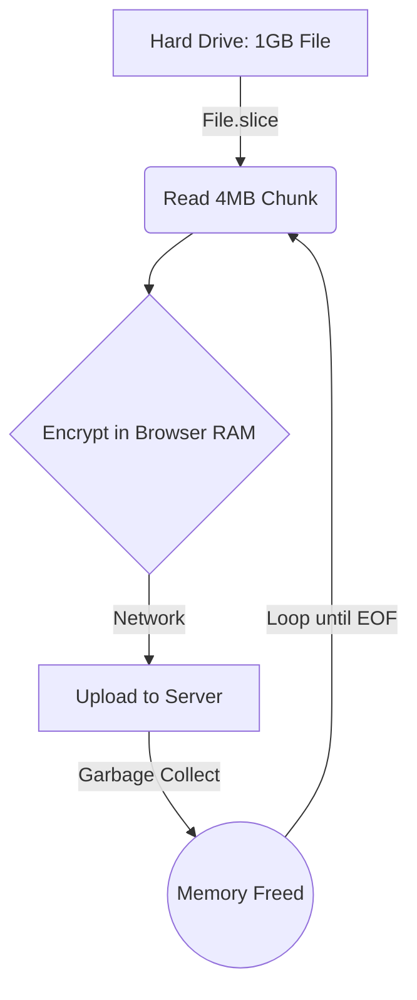
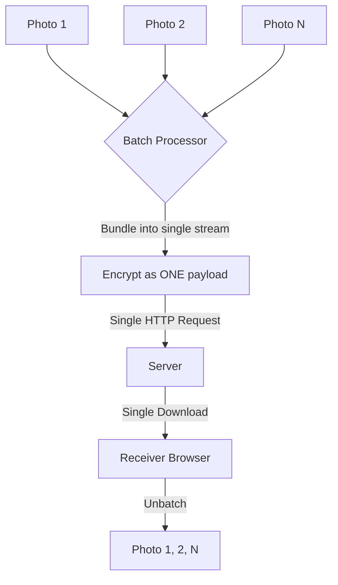
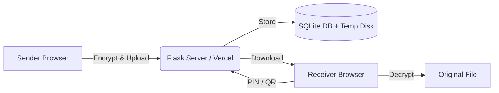
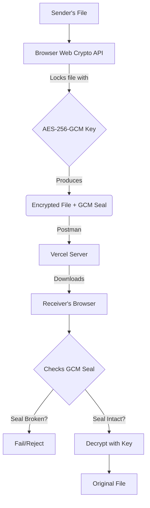

# FileShare Project — Complete Technical Explanation

This document provides a comprehensive technical architecture overview of the **FileShare** application, designed to be easily understood for a B.Tech CSE project viva or presentation.

---

## 1. Project Overview

### What is FileShare?
FileShare is a high-performance, secure, end-to-end encrypted file transfer application. It allows users to share files over the internet securely, generating a unique 6-digit PIN and a QR code for the receiver to download the file.

### Real-World Problem Solved
Traditional file-sharing services (like Google Drive or email) store your files unencrypted on their servers, meaning the provider can read your data. They also impose strict file size limits. FileShare solves this by encrypting the file *in the browser* before it even touches the network, and it handles large files (up to 1 GB) using a memory-safe chunking mechanism.

### Main Features
- **End-to-End Encryption (E2E):** The server never sees the unencrypted file or the encryption key.
- **Chunked Uploads:** Large files are uploaded in small pieces to bypass server limits.
- **Burn-on-Read:** Files can be configured to self-destruct after one download.
- **WebRTC Data Channels:** Peer-to-peer real-time sharing (where available).
- **QR Code & PIN sharing:** Easy mobile-friendly receiver access.
- **Stream & Batch Processing:** Handles single large files via streaming or multiple files by batching them into encrypted bundles.

### High-Performance Stream & Batch Processing
FileShare is engineered to handle massive workloads on constrained devices (like mobile phones) and serverless environments by utilizing two advanced data processing techniques: **Stream Processing** and **Batch Processing**.

#### 1. Stream Processing (Zero-Copy Encryption)
When a user uploads a large file (e.g., 1 GB), loading the entire file into the browser's RAM at once would cause the browser to crash or freeze. FileShare solves this using **Stream Processing**.

Instead of reading the whole file, it uses the HTML5 `File.slice()` API to read a small 4 MB chunk directly from the hard drive. It encrypts this single chunk, uploads it, and then discards it from memory before reading the next one. This keeps the application's memory footprint flat (around 4 MB) regardless of the total file size.

**Stream Processing Diagram:**


#### 2. Batch Processing (Multi-File Bundling)
If a user wants to send 100 small photos, making 100 separate HTTP requests (and doing 100 database inserts) would cause massive network overhead and latency due to TCP handshake delays. FileShare solves this using **Batch Processing**.

When multiple files are selected, the frontend batches them together into a single virtual archive (a `.bundle`). The entire batch is encrypted with a single AES key and transferred as one continuous stream. The receiver downloads one file and their browser splits it back into the original 100 photos.

**Batch Processing Diagram:**


### Data Storage Duration
Files are stored **temporarily**. The system is ephemeral. On platforms like Vercel, it uses the serverless `/tmp` directory. Background cleanup services and cron jobs automatically delete expired files.

---

## 2. Network Architecture

### Client-Server vs Peer-to-Peer
FileShare is a **Hybrid Architecture**:
1. **Client-Server (Primary):** The sender (Client) uploads the encrypted file to the Flask backend (Server). The receiver (Client) downloads it from the Server. 
2. **Peer-to-Peer (WebRTC extension):** If both users are online, the system can attempt to use WebRTC to transfer data directly between browsers without storing the file on the server. However, the REST API acts as the primary reliable fallback.

### Request-Response Flow (Client-Server)
1. **Sender (Client A)** initiates a REST API `POST` request to the Server to upload the file.
2. **Server** saves the file to disk/memory and stores metadata in a database.
3. **Receiver (Client B)** sends a `GET` request to the Server using the PIN.
4. **Server** responds with the encrypted file.

### Simple Architecture Diagram


---

## 3. Protocols Used

| Protocol | Layer | Why it is used / What it does in FileShare |
| :--- | :--- | :--- |
| **HTTPS (TLS)** | Application | Ensures the connection to the server is secure. Protects the API calls from eavesdropping. |
| **HTTP/1.1 or H2** | Application | Used for REST API calls (uploading chunks, fetching metadata). Carries JSON and binary file payloads. |
| **WebSocket** | Application | Used for real-time signaling. The sender and receiver can exchange WebRTC connection details instantly. |
| **WebRTC** | Application | Used for direct Peer-to-Peer data transfers. |
| **TCP** | Transport | Underlying protocol for HTTP and WebSockets. Ensures reliable, ordered, and error-checked delivery of file chunks. |
| **UDP** | Transport | Used by WebRTC for fast, real-time data streaming where minor packet loss is acceptable but speed is critical. |
| **STUN/TURN/ICE**| Application/Network| STUN finds the public IP of the user. TURN acts as a relay if a direct P2P connection fails due to strict NAT/Firewalls. ICE negotiates the best connection path. |
| **IP** | Network | Routes packets across the internet from the user's ISP to the Vercel server. |
| **DNS** | Application | Resolves the domain into an IP address. |

---

## 4. OSI and TCP/IP Model Mapping

### During a File Upload:

**TCP/IP Model Perspective:**
1. **Application Layer:** The React frontend uses JavaScript HTTP requests (XHR/Fetch) to send a chunk of the encrypted file.
2. **Transport Layer:** The OS network stack creates a **TCP segment**, adding source/destination ports (e.g., port 443 for HTTPS). It ensures the chunk arrives intact.
3. **Internet Layer:** IP adds routing headers to create an **IP Packet**, addressing it to the server's IP.
4. **Network Access Layer:** The packet is framed (e.g., Ethernet or Wi-Fi frame) and converted into electrical/radio signals (Physical layer) to send to the router.

---

## 5. Data Transmission & Flow 

### The Complete Data Flow Pipeline

`Sender File` ➔ `File Reading (ArrayBuffer slice)` ➔ `Chunking (4MB)` ➔ `Gzip Compression` ➔ `AES-256-GCM Encryption` ➔ `HTTP PUT (Network Packet)` ➔ `Server (/tmp disk)` ➔ `Receiver HTTP GET` ➔ `AES-256-GCM Decryption` ➔ `Gunzip Decompression` ➔ `Chunk Reassembly` ➔ `Original File`

### Chunking Details (Stream Processing)
- **Why?** Serverless platforms like Vercel have strict limits (e.g., max 4.5 MB per request). If a user uploads a 100 MB file in one go, the server crashes.
- **How?** The file is sliced into **2.5 MB to 4 MB chunks** in the browser. 
- **Tracking:** Each chunk is sent with metadata: `transfer_id`, `chunk_index`, and `total_chunks`. The receiver gets a stream, and because each chunk is prefixed with a 4-byte length header, the receiver knows exactly where one chunk ends and the next begins.

### How Files are Deleted (Data Lifecycle)
- **Burn-on-Read:** A strict security feature. The server uses an atomic database lock to ensure a file can only be downloaded exactly once. The moment the download completes, the server actively triggers `os.remove(file_path)` and drops the database row.
- **Scheduled Expiry:** If a file is not downloaded, it eventually expires (e.g., after 24 hours). The server runs a background Cron Job (`/api/v1/system/cleanup`) that sweeps the database and physically deletes any file whose `expires_at` timestamp has passed.

---

## 6. Data Structures Used

1. **Blob / File Object:** Used in the frontend to represent the raw file selected by the user. It allows reading the file without loading the entire 1 GB into RAM.
2. **ArrayBuffer / Uint8Array:** Used during encryption. Cryptographic operations require raw byte arrays, not text strings.
3. **FormData:** Used to construct the HTTP multipart requests for uploading chunks alongside metadata.
4. **Dictionary / JSON (Object):** Used for API communication.
5. **Relational Database Tables (SQLite):** Used on the backend. A `files` table stores rows containing metadata like `id`, `filename`, `expires_at`, `iv`, `salt`, and `download_count`.

---

## 7. File Representation

Regardless of whether the file is a PDF, JPG, MP4, or ZIP, computers see them as **Binary Data** (a sequence of 0s and 1s). 

- **FileShare DOES NOT use Base64.** Base64 converts binary to text, which increases the file size by 33%. 
- Instead, FileShare reads the file as an **ArrayBuffer** (raw bytes), encrypts those bytes, and sends them directly via HTTP `multipart/form-data` as a binary Blob (`application/octet-stream`).

---

## 8. Encryption, Security & Steganography

### End-to-End Encryption (E2E) using Web Crypto API
FileShare uses true E2E encryption powered entirely by the browser's native **Web Crypto API**. 

- **What is encrypted?** The file contents.
- **Where?** Inside the Sender's browser (Client-side) before it reaches the network.
- **Encryption Algorithm:** **AES-256-GCM** (Advanced Encryption Standard with Galois/Counter Mode). 
  - **AES-256** ensures the data is strictly confidential (military-grade).
  - **GCM (Galois/Counter Mode)** provides an authentication tag, which ensures **Data Integrity**. If the server or a hacker tampers with even a single byte of the encrypted file, the decryption will immediately fail in the receiver's browser.

### The "Vault" Key Exchange Mechanism
The key exchange acts as a secure mathematical vault:
1. The sender's browser generates a completely random 256-bit AES encryption key.
2. The browser generates a random 6-digit PIN.
3. The PIN is hashed using **PBKDF2 (Password-Based Key Derivation Function 2)** with 600,000 iterations and a random salt. This creates a highly secure "Wrapping Key".
4. The random AES key is then encrypted (wrapped) *using* the Wrapping Key. This creates the "Wrapped Key" blob.
5. The Wrapped Key is sent to the server. **The server never sees the PIN or the raw AES encryption key.**
6. When downloading, the receiver types the PIN. Their browser re-derives the Wrapping Key, decrypts the Wrapped Key to access the real AES key, and finally decrypts the file.

### Deep Dive: AES-256-GCM Client Cryptography (Explained Simply)
In your viva, if they ask how the encryption actually works, break down the acronym **AES-256-GCM Client Cryptography** into four simple parts:

#### 1. "Client Cryptography" (The Where)
Instead of sending your file to the server and asking the server to lock it, **your browser (the client) locks the file before it even touches the internet.**
- *Scenario:* It is like putting your letter inside a heavy steel safe *inside your house*, and then handing the locked safe to the postman (the server). Even if the postman opens the box, they can't read the letter.

#### 2. "AES" (The Lock)
**Advanced Encryption Standard** is the mathematical algorithm used to scramble the file. It is the same standard used by banks and the military.

#### 3. "256" (The Key Size)
This means the key has $2^{256}$ possible combinations. 
- *Scenario:* If all the computers on Earth worked together to guess the key, the sun would burn out before they found the right one.

#### 4. "GCM" (The Tamper-Evident Seal)
**Galois/Counter Mode** doesn't just encrypt the file; it attaches a "tag" (a digital signature). 
- *Scenario:* Imagine wrapping your steel safe in a special wax seal. If a hacker intercepts the safe and tries to inject a virus into the locked file, the wax seal breaks. When the receiver tries to open it, the GCM tag will notice the seal is broken, and the decryption will instantly fail, protecting the receiver.

**Simple Cryptography Flow Diagram:**


*Encryption in Transit* is handled by HTTPS (TLS). *Encryption at Rest* is handled by AES-256 on the disk.

### Steganography Image Vault
For extreme privacy and plausible deniability, FileShare features a **Steganography Image Vault**. 

Instead of uploading a standard binary file, the sender can choose to hide their encrypted file (up to ~10 MB) inside a generated image (a PNG picture). 
- **How it works:** The encrypted bytes are encoded directly into the pixel color channels (Red, Green, Blue) of a Canvas image using the **Least Significant Bit (LSB)** technique. 
- **The Result:** The server and network only see a normal-looking PNG image (a deep space artwork with a "SECVAULTv1" watermark). They have no idea that there is a highly-encrypted PDF or Zip file hidden inside the pixels. 
- **Extraction:** The receiver's browser reads the pixels, extracts the LSBs to rebuild the encrypted payload, and then uses the AES key to decrypt the original file.

---

## 9. Storage

- **Where?** Files are stored on the server's local file system (in Vercel, this is the ephemeral `/tmp` directory).
- **Metadata:** Stored in a local SQLite database (`app.db`).
- **Lifecycle:** Files are actively deleted via Burn-on-Read or swept by the automated Cron Job as described in the Data Flow section.

---

## 10. Backend Architecture

- **Framework:** Python Flask.
- **API Design:** RESTful structure.
  - `POST /api/v1/files` (Upload small file)
  - `POST /api/v1/transfers` (Initialize large file upload)
  - `PUT /api/v1/transfers/{id}/chunks/{index}` (Upload a piece)
  - `GET /api/v1/files/{id}` (Get metadata)
  - `GET /api/v1/files/{id}/content` (Download file)

---

## 11. Frontend Architecture

- **UI Framework:** React with Vite.
- **State Management:** React Context API / State Machine (managing states like `IDLE`, `ENCRYPTING`, `UPLOADING`, `READY`).
- **APIs Used:**
  - `Web Crypto API` (for AES encryption).
  - `File API` (for reading file slices without crashing RAM).
  - `XMLHttpRequest (XHR)` (used instead of `fetch` for uploads because XHR provides real-time `onprogress` upload tracking for the progress bar).

---

## 12. Complete Transmission Example

**Scenario: User A sends a 10 MB PDF to User B.**

1. **Selection:** User A selects `report.pdf`.
2. **Key Generation:** Browser A generates a 256-bit AES key and a 6-digit PIN (e.g., 123456).
3. **Chunking & Encryption:** The browser reads the first 4 MB, compresses it, encrypts it with AES, and repeats for the rest of the file.
4. **Transport (OSI Layer 4):** Browser A opens a TCP connection to the Vercel server.
5. **Upload (OSI Layer 7):** Browser A sends HTTP PUT requests containing the encrypted chunks.
6. **Storage:** The Vercel Server saves the encrypted bytes to `/tmp`.
7. **Sharing:** User A sends the PIN "123456" to User B.
8. **Request:** User B enters "123456". Browser B requests the file from the server via HTTP GET.
9. **Download:** The server streams the encrypted bytes back via TCP/IP.
10. **Decryption:** Browser B uses the PIN to unwrap the AES key and decrypts the bytes in memory.
11. **Reconstruction:** Browser B combines the decrypted bytes into a Blob and triggers a standard browser download for `report.pdf`.
12. **Cleanup:** The server deletes the file from `/tmp` based on expiration rules.

---

## 13. Viva Questions (30 Q&A)

1. **What is FileShare?** A secure, end-to-end encrypted file sharing web application.
2. **Which protocol does FileShare use for data transfer?** HTTP/HTTPS over TCP.
3. **Why use TCP instead of UDP for file uploads?** TCP guarantees that all file chunks arrive in the exact order without data loss. UDP does not guarantee delivery.
4. **What is HTTPS?** Hypertext Transfer Protocol Secure; it encrypts the communication channel between the browser and the server using TLS.
5. **What is TLS?** Transport Layer Security, the cryptographic protocol that provides HTTPS encryption.
6. **What is WebRTC?** Web Real-Time Communication, an API that allows browsers to communicate directly peer-to-peer.
7. **What is STUN?** Session Traversal Utilities for NAT; a server that tells a computer what its public IP address is.
8. **What is TURN?** Traversal Using Relays around NAT; a fallback server that relays data if a direct peer-to-peer WebRTC connection fails.
9. **What is ICE?** Interactive Connectivity Establishment; the framework WebRTC uses to find the best path.
10. **What is a packet?** The basic unit of data routed over an IP network (Network Layer).
11. **What is a segment?** The basic unit of data at the Transport Layer (TCP).
12. **What is a frame?** The basic unit of data at the Data Link Layer.
13. **What is chunking?** Breaking a large file into smaller pieces (e.g., 4MB) to send them individually.
14. **Why is chunking required?** To prevent high RAM usage in the browser and to bypass server request size limits.
15. **How is a file reconstructed?** The frontend collects all downloaded chunks into an array and combines them into a single `Blob` object.
16. **What data structure stores file metadata on the server?** A relational database table (SQLite).
17. **Where is the file stored?** Temporarily on the server's local file system (or `/tmp` in serverless).
18. **Is the file encrypted?** Yes, end-to-end using AES-256-GCM in the browser.
19. **What happens if transmission fails mid-upload?** The frontend can retry the specific failed chunk, or the transfer fails and the server's cron job cleans up the orphaned chunks later.
20. **What happens if the receiver disconnects?** The TCP connection drops. They must request the download again.
21. **How is file integrity verified?** AES-GCM includes an authentication tag that guarantees the data has not been tampered with.
22. **What is the difference between HTTP and WebSocket?** HTTP is request-response and stateless. WebSocket is a persistent, full-duplex connection for real-time data.
23. **Which OSI layers are involved in the upload?** All 7 layers. From the Application (HTTP) down to the Physical.
24. **How does DNS help?** It translates the human-readable domain into the server's IP address.
25. **What happens when the user clicks Download?** The browser creates an invisible `<a>` tag with a URL pointing to the decrypted Blob in memory and simulates a click to save it.
26. **What is an ArrayBuffer?** A JavaScript object representing a generic, fixed-length raw binary data buffer.
27. **Why not use Base64 for file transfer?** Base64 encoding increases file size by about 33% and wastes CPU cycles. Binary transfer is faster and smaller.
28. **What is PBKDF2?** Password-Based Key Derivation Function 2. It hashes the PIN heavily so it cannot be easily brute-forced.
29. **What is Burn-on-Read?** A security feature where the server deletes the file immediately after the first successful download.
30. **Does the server know my PIN?** No. The PIN is used locally to wrap the key. The server only stores the wrapped key, meaning the server cannot decrypt the file.


31. **Why didn\'t you make a separate storage limit for each user?** To maintain a 100% anonymous, privacy-first architecture. If we created per-user limits, we would need user logins or IP tracking, which compromises privacy. A global limit also protects our limited cloud server storage from crashing.
32. **When does the 1 GB global limit get full?** It gets full when the combined size of all currently active files uploaded by all users across the entire server reaches 1 GB. For example, if 10 users upload 100 MB each at the same time, the server hits 1 GB.
33. **What happens when the 1 GB storage is full?** The server blocks any new uploads and returns a "Storage Full" error. The user must wait until existing files expire or are downloaded by receivers to free up space.
34. **Does the Storage Meter look different for each user?** No, the Storage Meter is exactly the same for everyone. Because it tracks the global backend storage, every user acts as a viewer of the same public "fuel gauge" indicating the overall health and capacity of the server.
35. **How does the system free up space automatically?** Files permanently self-destruct from the server immediately once downloaded (if 'Burn After Read' is active). Otherwise, they are swept away by the server's background cleanup process once their set time limit expires.

---

## 8. Multi-File Transfer: Bundling, Encryption, and ZIP Download

### Why Multi-File Transfer is a Hard Problem

Naively, you might think: "Just upload 10 files, give 10 codes, receiver downloads 10 files." But this approach has major flaws:
- **10 separate encryption keys** = 10 separate QR codes the sender must share. Impossible to use.
- **10 separate HTTP requests** = huge network overhead from repeated TCP handshakes and TLS negotiation.
- **10 separate database records** = much heavier server load.
- **Mobile download block**: Mobile browsers silently block simultaneous JavaScript-triggered download requests to prevent malware spam.

FileShare solves all of these with a unified architecture: **one bundle, one key, one QR code, one download.**

---

### Step 1: Sender Side — Packing Files into the FSBUNDLE1 Binary Container

When the sender selects multiple files (or a folder), the frontend runs `packFiles()` from [`bundler.js`](frontend/src/utils/bundler.js) before encryption. This creates a custom, highly-efficient binary container called **FSBUNDLE1**.

#### FSBUNDLE1 Binary Wire Format

The binary layout on disk/network is:

```
[ Magic Header: 8 bytes "FSBUNDLE1" ]
[ Manifest Length: 4 bytes (Uint32, little-endian) ]
[ Manifest JSON: variable length (UTF-8 encoded) ]
[ File 1 raw bytes ]
[ File 2 raw bytes ]
[ File N raw bytes ]
```

**Component Breakdown:**

| Field | Size | Purpose |
|---|---|---|
| Magic Header | 8 bytes (`0x46 0x53 0x42 0x55 0x4e 0x44 0x4c 0x31`) | Unique identifier so the receiver can detect a bundle vs. a plain file |
| Manifest Length | 4 bytes (Uint32 LE) | How many bytes the JSON manifest occupies |
| Manifest JSON | Variable | JSON array listing every file: `{ "name": "photo.jpg", "size": 204800, "type": "image/jpeg" }` |
| File Data | Variable (per file) | Raw binary bytes of each file, concatenated in order |

**Example Manifest JSON:**
```json
{
  "version": 1,
  "files": [
    { "name": "vacation.jpg", "size": 2097152, "type": "image/jpeg" },
    { "name": "report.pdf",   "size": 512000,  "type": "application/pdf" },
    { "name": "notes.txt",    "size": 1024,    "type": "text/plain" }
  ]
}
```

This is a **self-describing format**: the manifest tells the receiver exactly where each file starts and ends within the binary stream, without needing any external index. This is identical in concept to how ZIP files work internally.

**Single File Optimization:** If only 1 file is selected, `packFiles()` returns it directly without adding the FSBUNDLE1 wrapper. This keeps the format overhead at zero for the common single-file case.

---

### Step 2: Encryption of the Bundle

After packing, the **entire bundle blob is treated as a single opaque binary payload** and passed to `encryptFile()` in [`crypto.js`](frontend/src/crypto.js). The encryption system has no awareness of the bundle structure inside — it simply sees a sequence of bytes to encrypt.

**Memory-Safe Chunked Encryption:**

For large bundles (> 4 MB), the encrypted is done chunk-by-chunk:

```
Bundle Blob
  │
  ├─[Chunk 0: bytes 0 → 4MB]
  │   → gzip compress
  │   → AES-256-GCM encrypt with IV₀ (derived from base IV + counter 0)
  │   → Prepend 4-byte length header
  │
  ├─[Chunk 1: bytes 4MB → 8MB]
  │   → gzip compress
  │   → AES-256-GCM encrypt with IV₁ (derived from base IV + counter 1)
  │   → Prepend 4-byte length header
  │
  └─[Chunk N...]
```

This means the entire bundle — including all its files — is encrypted as one atomic unit. A single 6-digit PIN decrypts the entire thing.

---

### Step 3: Server Upload — One File, One Record

The encrypted binary blob (containing all files) is uploaded to the server as a single HTTP multipart request. The server stores it as **one file** in `/tmp` and creates **one database record**. The manifest, file names, and file sizes are invisible to the server — it only sees an encrypted binary blob.

---

### Step 4: Receiver Side — Decryption and Bundle Unpacking

When the receiver enters the 6-digit PIN and clicks Download:

1. **Single HTTP GET:** The receiver's browser downloads the single encrypted blob from the server.
2. **AES-256-GCM Decryption (chunk by chunk):** The blob is decrypted in 4 MB chunks, yielding the full FSBUNDLE1 binary.
3. **Magic Header Check:** `isBundleData()` reads the first 8 bytes and checks for `FSBUNDLE1`. If found, it is a multi-file bundle.
4. **Manifest Parsing:** The manifest JSON is decoded. It tells the browser: "This bundle contains 3 files. File 1 is `vacation.jpg` (2 MB). File 2 is `report.pdf` (512 KB). File 3 is `notes.txt` (1 KB)."
5. **Byte Slicing:** Using the byte offsets derived from the sizes in the manifest, `unpackFiles()` slices the decrypted binary into individual `Uint8Array` segments for each file. No file is lost or corrupted, because the manifest is 100% accurate.
6. **Blob Creation:** Each `Uint8Array` is wrapped in a `Blob` with the correct MIME type (e.g., `image/jpeg`).

---

### Step 5: The Mobile Download Problem and ZIP Solution

**The Core Problem:**

The naive approach was to fire off N separate JavaScript download requests in a loop:
```js
// OLD BAD CODE — Broken on mobile!
files.forEach((file, index) => {
  setTimeout(() => triggerDownload(file), index * 200);
});
```

iOS Safari and Android Chrome **aggressively block multiple automatic downloads** triggered by JavaScript. They allow only the very first download and silently cancel the rest to prevent malware from dumping hundreds of files onto a user's phone. The user would get only the first file and have no idea the rest were missing.

**The Fix — Client-Side ZIP Generation with `fflate`:**

Instead of fighting the mobile browser's security policy, FileShare now generates a single standard `.zip` archive locally in the receiver's browser memory using `fflate` (a Wasm-free, 8 kB pure JavaScript compression engine).

```js
// NEW CORRECT CODE — Works on all devices!
import { zip } from 'fflate';

const zipObj = {};
files.forEach(file => {
  zipObj[file.name] = file.data; // Uint8Array for each file
});

zip(zipObj, { level: 0 }, (err, zippedData) => {
  // Single download of one .zip file — never blocked by mobile!
  triggerDownload(new Blob([zippedData], { type: 'application/zip' }),
    'FileShare_Bundle.zip');
});
```

**Why `level: 0` (Store Only)?**

Setting the ZIP compression level to `0` means `fflate` simply packages the files into the ZIP container format without trying to re-compress them. This is the optimal choice because:
- The files were already gzip-compressed during the upload encryption pipeline on the sender side. Trying to compress already-compressed data wastes CPU and may even make the ZIP larger.
- ZIP generation is now **near-instantaneous** — just a metadata header + raw byte copy, even for hundreds of megabytes.
- No risk of freezing the UI or draining the phone's battery.

**ZIP Format vs FSBUNDLE1:**

| Property | FSBUNDLE1 (internal) | ZIP (output) |
|---|---|---|
| Purpose | Transport container for encryption | Final user-facing archive |
| Standard | Custom proprietary | Industry standard (RFC 1952) |
| Readability | Only FileShare can open it | Every OS (Windows, macOS, Android, iOS) can open it natively |
| Compression | gzip per chunk (in encryption layer) | Store Only (level: 0), already compressed |
| Created at | Sender's browser | Receiver's browser |

---

### Full Multi-File Transfer Flow (End-to-End)

```
SENDER BROWSER                          SERVER              RECEIVER BROWSER
─────────────────                       ──────              ────────────────
Select 3 files
    │
    ▼
packFiles() → FSBUNDLE1 binary
    │ [magic][manifest][file1][file2][file3]
    ▼
encryptFile()
    │ gzip + AES-256-GCM each 4MB chunk
    │ Single encrypted blob
    ▼
Single HTTP PUT ─────────────────────► /tmp/abc.encrypted
Single DB INSERT                       DB: { id, iv, salt, wrapped_key }
    │
    ▼
Generate 6-digit PIN + QR Code
Share with receiver
                                                    ▼
                                            Enter 6-digit PIN
                                                    │
                                            Single HTTP GET ◄──── /tmp/abc.encrypted
                                                    │
                                            decryptFile()
                                            │ AES-256-GCM decrypt each chunk
                                            │ gunzip decompress
                                            │ → FSBUNDLE1 binary (reconstructed)
                                                    │
                                            unpackFiles()
                                            │ Check magic header ✓
                                            │ Parse manifest JSON
                                            │ Slice bytes → file1, file2, file3
                                                    │
                                            downloadAsZip()      [fflate]
                                            │ Packs Uint8Arrays into ZIP
                                            │ Single download trigger
                                                    │
                                                    ▼
                                            📦 FileShare_Bundle_3_files.zip
                                            (User extracts natively on any device)
```

---

### Q&A: Multi-File Bundling

**Q36: What is FSBUNDLE1?**
It is FileShare's custom binary container format for multi-file transfers. It uses a magic header (`FSBUNDLE1`) followed by a JSON manifest (which lists every file's name, size, and type) followed by the raw bytes of all files concatenated together.

**Q37: Why not just use a ZIP file to pack the files before encryption?**
We could, but it would be wasteful. The encryption pipeline already applies gzip compression per chunk. Zipping the files first and then gzip-compressing them again during encryption would just waste CPU time. FSBUNDLE1 skips the compression step and lets the encryption layer handle it.

**Q38: How does the receiver know where one file ends and the next begins in the binary blob?**
The manifest JSON at the start of the bundle contains the exact `size` in bytes for each file. The unpacker reads `size` bytes at a time, keeping a running byte offset. It never reads more or less than what the manifest says.

**Q39: What happens if the manifest gets corrupted during transfer?**
AES-256-GCM provides an authentication tag that covers every byte of the encrypted blob including the manifest. If even 1 bit is flipped, the `crypto.subtle.decrypt()` call throws an `OperationError` and the browser rejects the entire decryption. No partial or corrupted data is ever presented to the user.

**Q40: Why does downloading multiple files on mobile fail without the ZIP?**
iOS and Android browsers block JavaScript from triggering multiple simultaneous automatic downloads. This is a security policy to prevent malicious sites from dumping ransomware or spam files. The fix is to deliver all files as a single ZIP, which the phone can then natively extract.

**Q41: Does the ZIP generation happen on the server?**
No. The ZIP is generated entirely in the receiver's browser using the `fflate` JavaScript library. The server is completely uninvolved and never sees the file contents.

**Q42: What is fflate?**
`fflate` is a high-performance, pure-JavaScript compression library (8 kB, no Wasm). It implements the DEFLATE algorithm (the same algorithm used by ZIP and gzip). It runs completely in the browser and never sends data to any external server.

**Q43: Why is the ZIP download called `FileShare_Bundle_N_files.zip`?**
We auto-generate this name so the receiver immediately understands they received a multi-file transfer. They can extract it to get back their original files with their original names and folder structure preserved.
