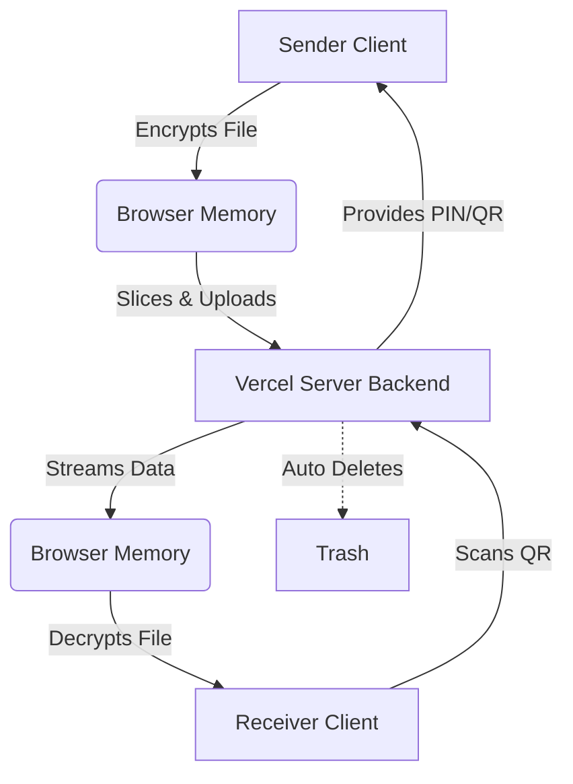

# 🚀 FileShare: Technical Explanation

This document explains the technical details of the FileShare web application in simple, beginner-friendly language. 

---

## 🌟 1. Project Overview & Features

### What is FileShare?
FileShare is a secure web app that lets you send files directly to anyone over the internet. It uses passwords and QR codes so only the right person gets it.

### End-to-End Encryption (Security)
Your files are locked mathematically inside your browser before sending. Only the receiver's 6-digit PIN can unlock them. The server never sees your actual files or passwords.

### Chunking for Large Files
Instead of sending a massive 1GB file at once, the browser slices it into tiny 4MB pieces. This prevents memory crashes and makes uploads incredibly fast and smooth.

### Multi-File Batching
When you send 50 photos, FileShare groups them into one single virtual bundle. This saves time, reduces network traffic, and speeds up the entire transfer process significantly.

### QR-Based Transfer
Receivers don't need to type long links. They just scan the QR code on the sender's screen using their phone camera, and the download starts securely and instantly.

### Burn-on-Read
For ultimate privacy, the server deletes your file permanently the exact second the receiver finishes downloading it. No traces, no logs, and no backups are left behind.

### Beautiful UI/UX
The design is sleek and modern. It uses glowing cards, live progress bars, animated countdown timers, and instant copy buttons to make sharing files effortless and visually stunning.

---

## 🏗️ 2. Architecture & Workflows

FileShare uses a hybrid Client-Server architecture deployed on Vercel.

### Upload Workflow (Sender)
1. You select a file on your device.
2. Your browser encrypts the file locally.
3. The file is sliced into small chunks and uploaded to the Flask backend.
4. The screen shows a 6-digit PIN and a QR code.

### Download Workflow (Receiver)
1. The receiver scans the QR code or types the 6-digit PIN.
2. The server streams the encrypted file chunks back to their browser.
3. The receiver's browser decrypts the chunks and rebuilds the original file.
4. The file saves directly to their hard drive.

### Diagram: Full System Architecture

---

## ⚠️ 3. Limitations & Edge Cases

### File Size & User Limits
You can send up to 1 GB of data, or a maximum of 20 files per transfer. This ensures the server never overloads and remains fast.

### Network Disconnections
If the internet drops mid-upload or mid-download, the system halts safely. It does not corrupt your data or save broken files on your device.

### Expiration & Timeout
If nobody downloads the file before the timer runs out, a background robot permanently deletes it from the server. This prevents the server from running out of storage space.
